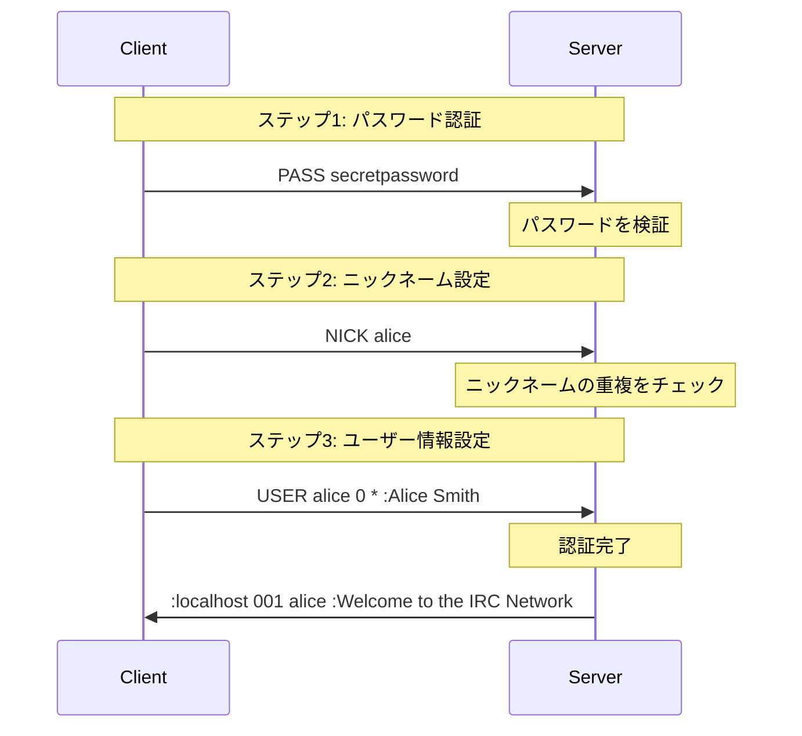
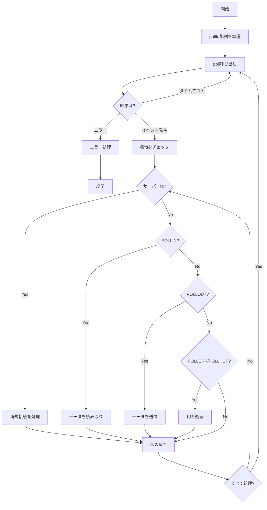

# 基礎知識

このドキュメントでは、ft_irc プロジェクトを理解するために必要な基礎知識を説明します。

## 目次

1. [IRC プロトコルの基礎](#ircプロトコルの基礎)
2. [C++98 の制約と注意点](#c98の制約と注意点)
3. [非ブロッキング I/O と poll()](#非ブロッキングioとpoll)

---

## IRC プロトコルの基礎

### IRC とは

**IRC (Internet Relay Chat)** は、リアルタイムのテキストメッセージングプロトコルです。1988 年に開発され、現在でも多くのオープンソースプロジェクトやコミュニティで使用されています。

#### IRC の特徴

- **クライアント・サーバーモデル**: クライアントはサーバーに接続し、サーバーを介して他のクライアントと通信
- **チャンネルベース**: ユーザーはチャンネル（#で始まる名前）に参加して会話
- **プライベートメッセージ**: ユーザー同士の直接メッセージも可能
- **オペレーター権限**: チャンネルの管理者が特別な権限を持つ

#### 基本的な用語

| 用語             | 説明                                                   |
| ---------------- | ------------------------------------------------------ |
| **サーバー**     | IRC ネットワークのノード。クライアントが接続する先     |
| **クライアント** | IRC サーバーに接続するユーザー                         |
| **チャンネル**   | 複数のユーザーが会話する場所（例: #general）           |
| **ニックネーム** | ユーザーの識別名                                       |
| **オペレーター** | チャンネルの管理権限を持つユーザー                     |
| **モード**       | チャンネルやユーザーの設定（例: 招待制、トピック制限） |

---

### IRC メッセージフォーマット

IRC プロトコルのメッセージは、以下の形式に従います：

```
[:<prefix>] <command> [<params>] [:<trailing>]
```

#### フォーマットの各要素

##### 1. Prefix（プレフィックス）- オプション

- `:` で始まる
- メッセージの送信元を示す
- サーバーからクライアントへのメッセージに含まれる
- 形式: `:nickname!username@hostname`

**例:**

```
:alice!alice@192.168.1.100
```

##### 2. Command（コマンド）- 必須

- 実行するアクション
- 大文字・小文字を区別しない（通常は大文字）
- 数値コード（3 桁）または文字列

**例:**

```
PRIVMSG    （文字列コマンド）
001        （数値コマンド - RPL_WELCOME）
```

##### 3. Params（パラメータ）- オプション

- スペースで区切られた引数
- 最大 15 個まで
- スペースを含まない

**例:**

```
#general alice
```

##### 4. Trailing（末尾パラメータ）- オプション

- `:` で始まる
- スペースを含むことができる最後のパラメータ
- メッセージ本文などに使用

**例:**

```
:Hello, everyone!
```

#### メッセージの終端

すべての IRC メッセージは `\r\n`（CRLF）で終了します。

```
PRIVMSG #general :Hello, world!\r\n
```

---

### メッセージの実例

#### 例 1: クライアントからサーバーへ（PRIVMSG）

```
PRIVMSG #general :Hello, everyone!\r\n
```

- **Prefix**: なし（クライアントからの送信）
- **Command**: `PRIVMSG`
- **Params**: `#general`
- **Trailing**: `Hello, everyone!`

#### 例 2: サーバーからクライアントへ（数値応答）

```
:localhost 001 alice :Welcome to the Internet Relay Network alice!alice@192.168.1.100\r\n
```

- **Prefix**: `localhost`（サーバー名）
- **Command**: `001`（RPL_WELCOME）
- **Params**: `alice`（受信者のニックネーム）
- **Trailing**: `Welcome to the Internet Relay Network alice!alice@192.168.1.100`

#### 例 3: サーバーからクライアントへ（JOIN 通知）

```
:alice!alice@192.168.1.100 JOIN #general\r\n
```

- **Prefix**: `alice!alice@192.168.1.100`（参加したユーザー）
- **Command**: `JOIN`
- **Params**: `#general`
- **Trailing**: なし

---

### 数値応答コード

IRC サーバーは、コマンドの結果を数値コードで返します。

#### 応答コードの分類

| 範囲    | 種類       | 説明                               |
| ------- | ---------- | ---------------------------------- |
| 001-099 | 接続・登録 | 接続成功、ウェルカムメッセージなど |
| 200-399 | 成功応答   | コマンドが正常に実行された         |
| 400-599 | エラー応答 | コマンドが失敗した                 |

#### 主要な成功応答（RPL\_\*）

| コード | 名前           | 説明                                   |
| ------ | -------------- | -------------------------------------- |
| 001    | RPL_WELCOME    | 接続成功のウェルカムメッセージ         |
| 331    | RPL_NOTOPIC    | チャンネルにトピックが設定されていない |
| 332    | RPL_TOPIC      | チャンネルのトピックを表示             |
| 353    | RPL_NAMREPLY   | チャンネルメンバーのリスト             |
| 366    | RPL_ENDOFNAMES | メンバーリストの終了                   |

#### 主要なエラー応答（ERR\_\*）

| コード | 名前                 | 説明                               |
| ------ | -------------------- | ---------------------------------- |
| 401    | ERR_NOSUCHNICK       | 指定されたニックネームが存在しない |
| 403    | ERR_NOSUCHCHANNEL    | 指定されたチャンネルが存在しない   |
| 442    | ERR_NOTONCHANNEL     | チャンネルに参加していない         |
| 461    | ERR_NEEDMOREPARAMS   | パラメータが不足している           |
| 462    | ERR_ALREADYREGISTRED | すでに認証済み                     |
| 464    | ERR_PASSWDMISMATCH   | パスワードが間違っている           |
| 471    | ERR_CHANNELISFULL    | チャンネルが満員                   |
| 473    | ERR_INVITEONLYCHAN   | 招待制チャンネル                   |
| 475    | ERR_BADCHANNELKEY    | チャンネルキーが間違っている       |
| 482    | ERR_CHANOPRIVSNEEDED | オペレーター権限が必要             |

#### 応答コードの使用例

```cpp
// C++での数値応答の生成
std::string createWelcome(const std::string& nickname) {
    return ":localhost 001 " + nickname +
           " :Welcome to the Internet Relay Network\r\n";
}

std::string createError(const std::string& nickname) {
    return ":localhost 461 " + nickname +
           " PRIVMSG :Not enough parameters\r\n";
}
```

---

### 認証フロー

IRC サーバーに接続するには、以下の 3 つのコマンドを順番に送信する必要があります。

#### 認証の 3 ステップ



#### 1. PASS - パスワード認証

サーバーに設定されたパスワードを送信します。

**構文:**

```
PASS <password>
```

**例:**

```
PASS secretpassword\r\n
```

**重要なポイント:**

- 🎯 認証の最初のステップ
- ⚠️ NICK や USER の前に送信する必要がある
- ⚠️ パスワードが間違っている場合、ERR_PASSWDMISMATCH (464) が返される
- 📌 すでに認証済みの場合、ERR_ALREADYREGISTRED (462) が返される

#### 2. NICK - ニックネーム設定

ユーザーのニックネームを設定します。

**構文:**

```
NICK <nickname>
```

**例:**

```
NICK alice\r\n
```

**ニックネームのルール:**

- 1-9 文字
- 最初の文字は英字または `_`
- 2 文字目以降は英数字、`_`、`-` が使用可能
- サーバー内で一意である必要がある

**エラーケース:**

- ニックネームが既に使用されている → ERR_NICKNAMEINUSE (433)
- ニックネームが無効 → ERR_ERRONEUSNICKNAME (432)
- ニックネームが指定されていない → ERR_NONICKNAMEGIVEN (431)

#### 3. USER - ユーザー情報設定

ユーザーの詳細情報を設定します。

**構文:**

```
USER <username> <hostname> <servername> <realname>
```

**例:**

```
USER alice 0 * :Alice Smith\r\n
```

**パラメータ:**

- `username`: ユーザー名
- `hostname`: ホスト名（通常は `0` を使用）
- `servername`: サーバー名（通常は `*` を使用）
- `realname`: 実名（`:` で始まる trailing パラメータ）

#### 認証完了

3 つのコマンドがすべて正常に処理されると、サーバーは RPL_WELCOME (001) を返します。

**例:**

```
:localhost 001 alice :Welcome to the Internet Relay Network alice!alice@192.168.1.100\r\n
```

#### 認証フローの実装例

```cpp
// クライアントの認証状態を管理
class Client {
private:
    bool _hasPassword;  // PASSコマンドを受信したか
    bool _hasNick;      // NICKコマンドを受信したか
    bool _hasUser;      // USERコマンドを受信したか
    bool _isAuthenticated;  // 認証完了したか

public:
    // 認証完了をチェック
    void checkAuthentication() {
        if (_hasPassword && _hasNick && _hasUser && !_isAuthenticated) {
            _isAuthenticated = true;
            // RPL_WELCOMEを送信
            sendWelcomeMessage();
        }
    }
};
```

---

## C++98 の制約と注意点

ft_irc プロジェクトは **C++98 標準** に準拠する必要があります。

### C++98 とは

C++98 は、1998 年に標準化された C++の最初の公式標準です。現代の C++（C++11 以降）と比べて、多くの機能が制限されています。

---

### 使用可能な機能

#### STL コンテナ

✅ 以下の STL コンテナは使用可能です：

```cpp
#include <vector>
std::vector<int> numbers;
numbers.push_back(42);

#include <map>
std::map<std::string, Client*> clients;
clients["alice"] = new Client();

#include <set>
std::set<std::string> nicknames;
nicknames.insert("alice");

#include <string>
std::string message = "Hello";

#include <list>
std::list<int> myList;

#include <deque>
std::deque<int> myDeque;
```

#### STL アルゴリズム

```cpp
#include <algorithm>

// 検索
std::vector<int>::iterator it = std::find(vec.begin(), vec.end(), 42);

// ソート
std::sort(vec.begin(), vec.end());

// 変換（大文字化など）
std::transform(str.begin(), str.end(), str.begin(), ::toupper);
```

#### 文字列ストリーム

```cpp
#include <sstream>

// 文字列から数値への変換
std::istringstream iss("42");
int number;
iss >> number;

// 文字列の構築
std::ostringstream oss;
oss << "Code: " << 001;
std::string result = oss.str();
```

#### イテレータ

```cpp
// イテレータを使ったループ
std::vector<int>::iterator it;
for (it = vec.begin(); it != vec.end(); ++it) {
    std::cout << *it << std::endl;
}

// mapのイテレータ
std::map<std::string, int>::iterator mit;
for (mit = myMap.begin(); mit != myMap.end(); ++mit) {
    std::cout << mit->first << ": " << mit->second << std::endl;
}
```

---

### 禁止されている機能

#### C++11 以降の機能

❌ 以下の機能は使用できません：

```cpp
// auto キーワード
auto x = 42;  // ❌ 禁止

// nullptr
Client* ptr = nullptr;  // ❌ 禁止
Client* ptr = NULL;     // ✅ OK（C++98）

// ラムダ式
std::sort(vec.begin(), vec.end(), [](int a, int b) { return a < b; });  // ❌ 禁止

// range-based for ループ
for (int x : vec) {  // ❌ 禁止
    std::cout << x;
}

// 従来のforループを使用
for (size_t i = 0; i < vec.size(); ++i) {  // ✅ OK
    std::cout << vec[i];
}

// std::array
std::array<int, 5> arr;  // ❌ 禁止（C++11）
int arr[5];              // ✅ OK（C配列）

// std::unordered_map
std::unordered_map<std::string, int> map;  // ❌ 禁止
std::map<std::string, int> map;            // ✅ OK

// スマートポインタ
std::unique_ptr<Client> client;  // ❌ 禁止
Client* client = new Client();   // ✅ OK（手動メモリ管理）
```

#### 外部ライブラリ

❌ **Boost** や他の外部ライブラリは使用できません。

---

### コンパイラフラグ

プロジェクトは以下のフラグでコンパイルする必要があります：

```makefile
CXXFLAGS = -Wall -Wextra -Werror -std=c++98
```

- `-Wall`: すべての警告を有効化
- `-Wextra`: 追加の警告を有効化
- `-Werror`: 警告をエラーとして扱う
- `-std=c++98`: C++98 標準に準拠

⚠️ **警告が 1 つでもあるとコンパイルエラーになります！**

---

### C++98 でのベストプラクティス

#### 1. const correctness

```cpp
// メンバー関数で状態を変更しない場合はconstを付ける
class Client {
public:
    std::string getNickname() const {  // ✅ const付き
        return _nickname;
    }

    void setNickname(const std::string& nickname) {  // ✅ const参照
        _nickname = nickname;
    }

private:
    std::string _nickname;
};
```

#### 2. 参照渡しの活用

```cpp
// 値渡し（コピーが発生）
void processMessage(std::string message) {  // ❌ 非効率
    // ...
}

// const参照渡し（コピーなし）
void processMessage(const std::string& message) {  // ✅ 効率的
    // ...
}
```

#### 3. イテレータの安全な使用

```cpp
// イテレータを無効化する操作に注意
std::map<int, Client*>::iterator it = clients.begin();
while (it != clients.end()) {
    if (shouldRemove(it->second)) {
        clients.erase(it++);  // ✅ 後置インクリメントで安全に削除
    } else {
        ++it;
    }
}
```

#### 4. メモリ管理

```cpp
// newで確保したメモリは必ずdeleteする
Client* client = new Client();
// ... 使用 ...
delete client;  // ✅ 忘れずに解放

// 例外安全性を考慮
try {
    Client* client = new Client();
    // ... 処理 ...
    delete client;
} catch (const std::exception& e) {
    // エラー処理
}
```

---

## 非ブロッキング I/O と poll()

### ブロッキング vs 非ブロッキング

#### ブロッキング I/O

通常の I/O 操作は **ブロッキング** です。つまり、データが利用可能になるまで処理が停止します。

```cpp
// ブロッキングread - データが来るまで待機
char buffer[512];
int bytes = read(fd, buffer, sizeof(buffer));  // ここで停止
```

**問題点:**

- 1 つのクライアントを待っている間、他のクライアントを処理できない
- 複数のクライアントを同時に扱えない

#### 非ブロッキング I/O

**非ブロッキング I/O** では、データがない場合でも即座に戻ります。

```cpp
// 非ブロッキングread - データがなければすぐに戻る
char buffer[512];
int bytes = read(fd, buffer, sizeof(buffer));
if (bytes == -1 && errno == EAGAIN) {
    // データがまだ来ていない（エラーではない）
}
```

**利点:**

- 複数のクライアントを同時に処理できる
- 1 つのスレッドで多数の接続を管理できる

---

### fcntl()で非ブロッキング設定

ファイルディスクリプタを非ブロッキングモードに設定するには、`fcntl()` を使用します。

```cpp
#include <fcntl.h>

void setNonBlocking(int fd) {
    fcntl(fd, F_SETFL, O_NONBLOCK);
}
```

⚠️ **重要**: ft_irc プロジェクトでは、`fcntl()` の使用は **この用途のみ** に制限されています。

```cpp
// ✅ 許可されている使用方法
fcntl(fd, F_SETFL, O_NONBLOCK);

// ❌ 禁止されている使用方法
fcntl(fd, F_GETFL);           // フラグの取得
fcntl(fd, F_SETFL, O_APPEND); // 他のフラグの設定
```

---

### poll()の仕組み

`poll()` は、複数のファイルディスクリプタを監視し、I/O 可能になったものを通知してくれます。

#### poll()の基本構文

```cpp
#include <poll.h>

int poll(struct pollfd *fds, nfds_t nfds, int timeout);
```

**パラメータ:**

- `fds`: 監視するファイルディスクリプタの配列
- `nfds`: 配列の要素数
- `timeout`: タイムアウト（ミリ秒）、-1 で無限待機

**戻り値:**

- 正の数: イベントが発生したファイルディスクリプタの数
- 0: タイムアウト
- -1: エラー

#### pollfd 構造体

```cpp
struct pollfd {
    int   fd;       // ファイルディスクリプタ
    short events;   // 監視するイベント（入力）
    short revents;  // 発生したイベント（出力）
};
```

#### イベントの種類

| イベント   | 説明                         |
| ---------- | ---------------------------- |
| `POLLIN`   | 読み取り可能なデータがある   |
| `POLLOUT`  | 書き込み可能                 |
| `POLLERR`  | エラーが発生                 |
| `POLLHUP`  | 接続が切断された             |
| `POLLNVAL` | 無効なファイルディスクリプタ |

---

### poll()の使用例

#### 基本的な使い方

```cpp
#include <poll.h>
#include <vector>

// pollfd構造体の配列を準備
std::vector<struct pollfd> fds;

// サーバーソケットを追加
struct pollfd server_pfd;
server_pfd.fd = serverFd;
server_pfd.events = POLLIN;  // 新規接続を監視
server_pfd.revents = 0;
fds.push_back(server_pfd);

// クライアントソケットを追加
struct pollfd client_pfd;
client_pfd.fd = clientFd;
client_pfd.events = POLLIN | POLLOUT;  // 読み書き両方を監視
client_pfd.revents = 0;
fds.push_back(client_pfd);

// poll()を呼び出す
int result = poll(&fds[0], fds.size(), -1);  // 無限待機

if (result < 0) {
    // エラー処理
    std::cerr << "poll() failed" << std::endl;
} else if (result > 0) {
    // イベントが発生したファイルディスクリプタをチェック
    for (size_t i = 0; i < fds.size(); ++i) {
        if (fds[i].revents & POLLIN) {
            // 読み取り可能
            handleRead(fds[i].fd);
        }
        if (fds[i].revents & POLLOUT) {
            // 書き込み可能
            handleWrite(fds[i].fd);
        }
        if (fds[i].revents & (POLLERR | POLLHUP | POLLNVAL)) {
            // エラーまたは切断
            handleDisconnect(fds[i].fd);
        }
    }
}
```

---

### ft_irc プロジェクトでの poll()の制約

⚠️ **重要な制約**: プロジェクトでは **poll()を 1 つだけ** 使用する必要があります。

#### ❌ 禁止されているパターン

```cpp
// 複数のpoll()を使用（禁止）
poll(&read_fds[0], read_fds.size(), -1);
poll(&write_fds[0], write_fds.size(), -1);  // ❌ 2つ目のpoll()

// EAGAINでの再試行ループ（禁止）
while (recv(fd, buffer, size, 0) == -1 && errno == EAGAIN) {
    // ❌ poll()なしで再試行
}
```

#### ✅ 正しいパターン

```cpp
// 1つのpoll()ですべてのファイルディスクリプタを監視
std::vector<struct pollfd> fds;

// サーバーとすべてのクライアントを追加
fds.push_back(server_pfd);
fds.push_back(client1_pfd);
fds.push_back(client2_pfd);
// ...

// 1つのpoll()で監視
int result = poll(&fds[0], fds.size(), -1);

// すべてのI/O操作の前にpoll()を呼ぶ
if (fds[i].revents & POLLIN) {
    recv(fds[i].fd, buffer, size, 0);  // ✅ poll()の後なので安全
}
```

---

### poll()を使ったサーバーの基本構造

```cpp
class Server {
private:
    int _serverFd;
    std::vector<struct pollfd> _pollFds;
    std::map<int, Client*> _clients;

public:
    void start() {
        // サーバーソケットをpollに追加
        struct pollfd pfd;
        pfd.fd = _serverFd;
        pfd.events = POLLIN;
        pfd.revents = 0;
        _pollFds.push_back(pfd);

        // メインループ
        while (true) {
            // すべてのファイルディスクリプタを監視
            int result = poll(&_pollFds[0], _pollFds.size(), -1);

            if (result < 0) {
                // エラー処理
                if (errno == EINTR) continue;  // シグナルで中断された場合
                std::cerr << "poll() failed" << std::endl;
                break;
            }

            // イベントが発生したファイルディスクリプタを処理
            for (size_t i = 0; i < _pollFds.size(); ++i) {
                if (_pollFds[i].revents == 0)
                    continue;  // イベントなし

                if (_pollFds[i].fd == _serverFd) {
                    // 新規接続
                    if (_pollFds[i].revents & POLLIN)
                        handleNewConnection();
                } else {
                    // クライアントデータ
                    if (_pollFds[i].revents & POLLIN)
                        handleClientRead(_pollFds[i].fd);
                    if (_pollFds[i].revents & POLLOUT)
                        handleClientWrite(_pollFds[i].fd);
                    if (_pollFds[i].revents & (POLLERR | POLLHUP))
                        handleClientDisconnect(_pollFds[i].fd);
                }
            }
        }
    }
};
```

---

### poll()のフローチャート



---

## 部分送受信の処理

非ブロッキング I/O では、データが部分的にしか送受信されないことがあります。

### 部分受信

```cpp
// 受信バッファを持つ
std::string _recvBuffer;

void handleReceive(int fd) {
    char buffer[512];
    int bytes = recv(fd, buffer, sizeof(buffer) - 1, 0);

    if (bytes > 0) {
        buffer[bytes] = '\0';
        _recvBuffer += std::string(buffer, bytes);  // バッファに追加

        // 完全なメッセージ（\r\nまで）があるかチェック
        while (true) {
            size_t pos = _recvBuffer.find("\r\n");
            if (pos == std::string::npos)
                break;  // 完全なメッセージがない

            // メッセージを抽出
            std::string message = _recvBuffer.substr(0, pos);
            _recvBuffer.erase(0, pos + 2);  // \r\nも削除

            // メッセージを処理
            processMessage(message);
        }
    }
}
```

### 部分送信

```cpp
// 送信バッファを持つ
std::string _sendBuffer;

void queueMessage(const std::string& message) {
    _sendBuffer += message;  // 送信キューに追加
}

void handleSend(int fd) {
    if (_sendBuffer.empty())
        return;

    int bytes = send(fd, _sendBuffer.c_str(), _sendBuffer.size(), 0);

    if (bytes > 0) {
        _sendBuffer.erase(0, bytes);  // 送信済みの部分を削除
    } else if (bytes < 0) {
        if (errno != EAGAIN && errno != EWOULDBLOCK) {
            // 実際のエラー
            handleError();
        }
        // EAGAIN/EWOULDBLOCKの場合は次のpoll()で再試行
    }
}
```

---

## まとめ

### IRC プロトコル

- ✅ メッセージフォーマット: `[:<prefix>] <command> [<params>] [:<trailing>]\r\n`
- ✅ 認証フロー: PASS → NICK → USER → RPL_WELCOME
- ✅ 数値応答コード: 成功（001-399）、エラー（400-599）

### C++98

- ✅ STL コンテナ（vector, map, set, string）を活用
- ❌ C++11 以降の機能（auto, nullptr, lambda, range-based for）は禁止
- ✅ const correctness と参照渡しを活用

### 非ブロッキング I/O

- ✅ `fcntl(fd, F_SETFL, O_NONBLOCK)` で非ブロッキング設定
- ✅ `poll()` で複数のファイルディスクリプタを監視
- ⚠️ poll()は 1 つだけ使用
- ✅ 部分送受信に対応したバッファ管理

---

**次のステップ**: [02_ARCHITECTURE.md](02_ARCHITECTURE.md) でシステム全体のアーキテクチャを学びましょう。
