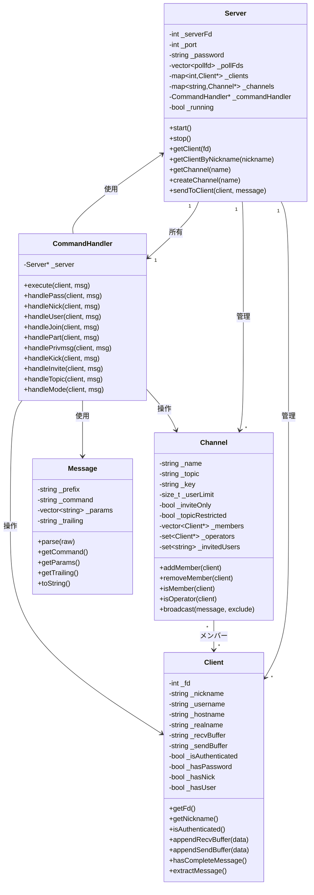
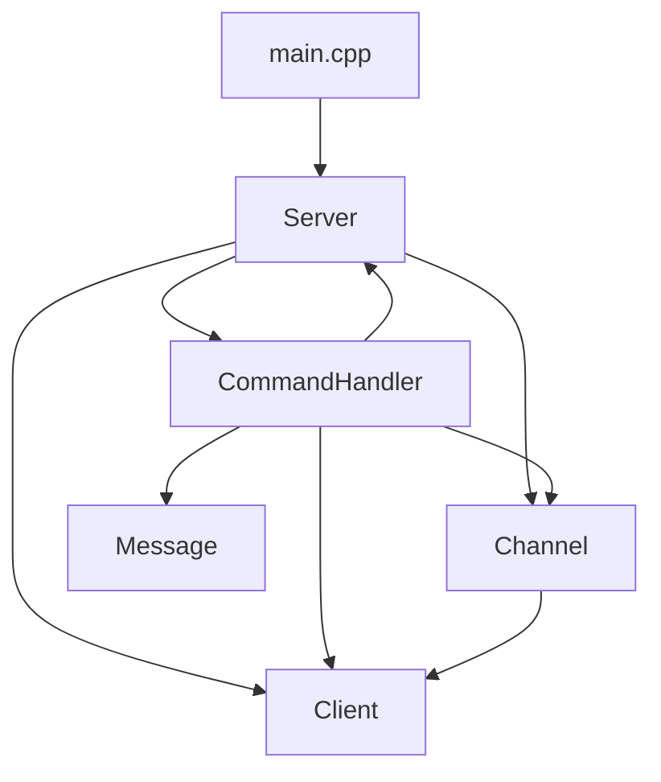
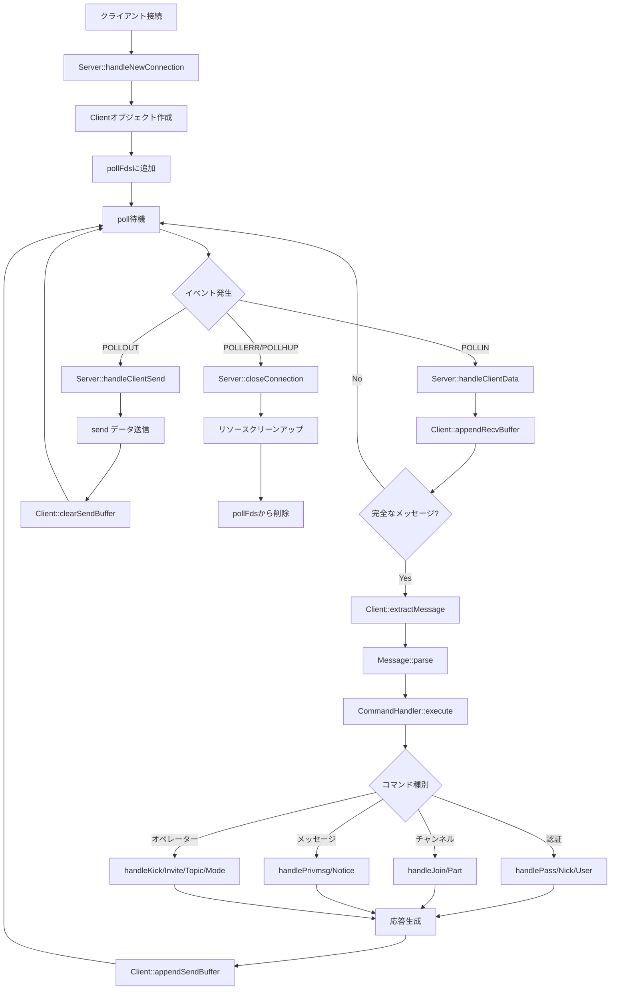
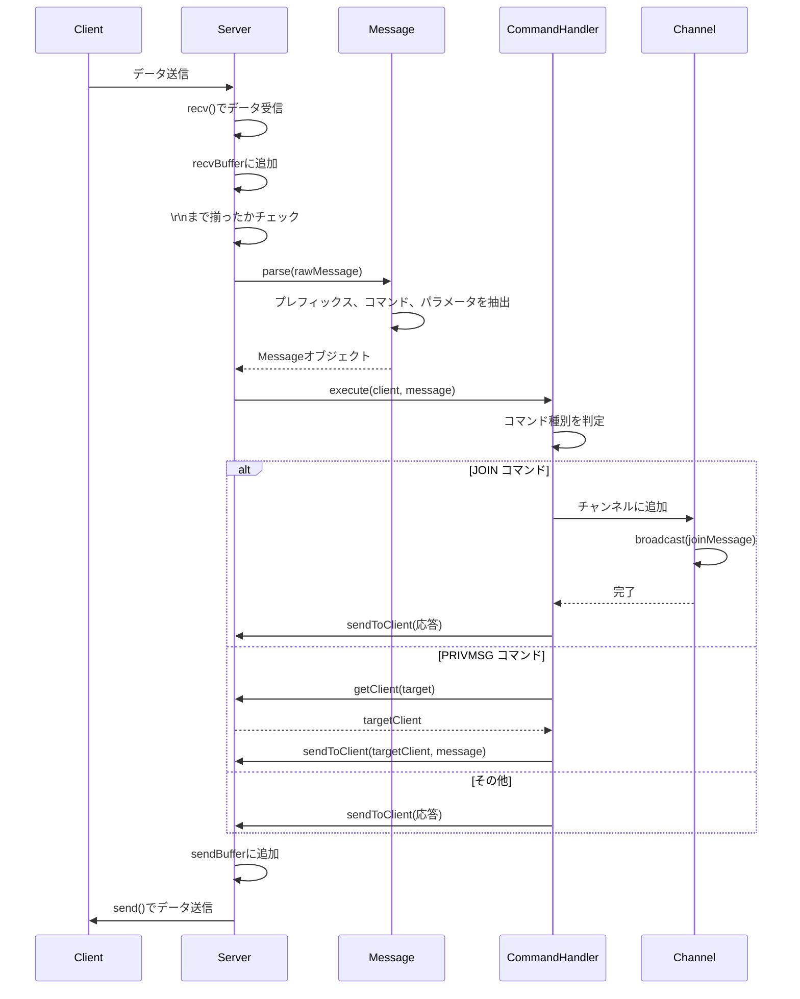

# システムアーキテクチャ

このドキュメントでは、ft_ircプロジェクトの全体的なアーキテクチャと設計を説明します。

## 目次

1. [システム概要](#システム概要)
2. [5つの主要クラス](#5つの主要クラス)
3. [クラス図](#クラス図)
4. [ディレクトリ構造](#ディレクトリ構造)
5. [ビルドシステム](#ビルドシステム)
6. [データフローの概要](#データフローの概要)

---

## システム概要

ft_ircは、**シングルスレッド**、**非ブロッキングI/O**、**イベント駆動型**のIRCサーバーです。

### 設計の特徴

- 🎯 **シングルスレッド**: 1つのメインループですべての接続を処理
- 🎯 **非ブロッキングI/O**: `poll()` を使用して複数の接続を同時に管理
- 🎯 **イベント駆動**: I/Oイベントに応じて処理を実行
- 🎯 **C++98準拠**: 古いC++標準に準拠した実装

### アーキテクチャパターン

```
Reactor Pattern (イベント駆動型)
├── Event Demultiplexer (poll())
├── Event Handlers (各種処理)
└── Resources (クライアント、チャンネル)
```

---

## 5つの主要クラス

ft_ircは、以下の5つの主要クラスで構成されています。

### 1. Server - サーバーの心臓部

**役割**: システム全体の制御とイベントループの管理

```cpp
class Server {
private:
    int                             _serverFd;      // サーバーソケット
    int                             _port;          // ポート番号
    std::string                     _password;      // サーバーパスワード
    std::vector<struct pollfd>      _pollFds;       // poll()用のfd配列
    std::map<int, Client*>          _clients;       // クライアント管理
    std::map<std::string, Channel*> _channels;      // チャンネル管理
    CommandHandler*                 _commandHandler; // コマンドハンドラ
    bool                            _running;       // 実行状態
};
```

**主な責務:**
- ソケットの作成とバインド
- poll()によるイベント監視
- 新規接続の受け入れ
- クライアントとチャンネルの管理
- メッセージのルーティング

---

### 2. Client - クライアント状態の管理

**役割**: 個々のクライアントの情報と状態を保持

```cpp
class Client {
private:
    int         _fd;              // ファイルディスクリプタ
    std::string _nickname;        // ニックネーム
    std::string _username;        // ユーザー名
    std::string _hostname;        // ホスト名
    std::string _realname;        // 実名
    std::string _recvBuffer;      // 受信バッファ
    std::string _sendBuffer;      // 送信バッファ
    bool        _isAuthenticated; // 認証済みか
    bool        _hasPassword;     // PASSコマンド受信済みか
    bool        _hasNick;         // NICKコマンド受信済みか
    bool        _hasUser;         // USERコマンド受信済みか
};
```

**主な責務:**
- クライアント情報の保持
- 認証状態の管理
- 送受信バッファの管理
- メッセージの抽出（\r\nまで）

---

### 3. Channel - チャンネルの管理

**役割**: IRCチャンネルの状態とメンバーを管理

```cpp
class Channel {
private:
    std::string              _name;           // チャンネル名
    std::string              _topic;          // トピック
    std::string              _key;            // チャンネルキー（パスワード）
    size_t                   _userLimit;      // ユーザー数制限
    bool                     _inviteOnly;     // 招待制モード
    bool                     _topicRestricted; // トピック制限モード
    std::vector<Client*>     _members;        // メンバーリスト
    std::set<Client*>        _operators;      // オペレーターリスト
    std::set<std::string>    _invitedUsers;   // 招待済みユーザー
};
```

**主な責務:**
- チャンネルメンバーの管理
- オペレーター権限の管理
- チャンネルモードの管理（i, t, k, o, l）
- メッセージのブロードキャスト
- 招待システムの管理

---

### 4. Message - メッセージのパース

**役割**: IRCメッセージの解析と生成

```cpp
class Message {
private:
    std::string              _prefix;   // プレフィックス（送信元）
    std::string              _command;  // コマンド
    std::vector<std::string> _params;   // パラメータ
    std::string              _trailing; // 末尾パラメータ
};
```

**主な責務:**
- IRCメッセージのパース
- メッセージの構築
- 数値応答の生成

**関連する名前空間:**
```cpp
namespace RPL {  // 成功応答コード
    const int WELCOME = 1;
    const int NOTOPIC = 331;
    const int TOPIC = 332;
    // ...
}

namespace ERR {  // エラー応答コード
    const int NOSUCHNICK = 401;
    const int NOSUCHCHANNEL = 403;
    // ...
}
```

---

### 5. CommandHandler - コマンド処理

**役割**: IRCコマンドの実行とバリデーション

```cpp
class CommandHandler {
private:
    Server* _server;  // サーバーへの参照

public:
    // コマンド実行
    void execute(Client* client, const Message& msg);
    
    // 認証コマンド
    void handlePass(Client* client, const Message& msg);
    void handleNick(Client* client, const Message& msg);
    void handleUser(Client* client, const Message& msg);
    
    // チャンネルコマンド
    void handleJoin(Client* client, const Message& msg);
    void handlePart(Client* client, const Message& msg);
    
    // メッセージコマンド
    void handlePrivmsg(Client* client, const Message& msg);
    void handleNotice(Client* client, const Message& msg);
    
    // オペレーターコマンド
    void handleKick(Client* client, const Message& msg);
    void handleInvite(Client* client, const Message& msg);
    void handleTopic(Client* client, const Message& msg);
    void handleMode(Client* client, const Message& msg);
    
    // ユーティリティコマンド
    void handlePing(Client* client, const Message& msg);
    void handleQuit(Client* client, const Message& msg);
};
```

**主な責務:**
- コマンドのディスパッチ
- パラメータのバリデーション
- 権限チェック
- エラー応答の生成

---

## クラス図

### 全体のクラス関係



### クラス間の依存関係



---

## ディレクトリ構造

### プロジェクト全体

```
ft_irc/
├── Makefile                    # ビルド設定
├── README.md                   # プロジェクト概要
├── includes/                   # ヘッダーファイル
│   ├── Server.hpp             # Serverクラス
│   ├── Client.hpp             # Clientクラス
│   ├── Channel.hpp            # Channelクラス
│   ├── CommandHandler.hpp     # CommandHandlerクラス
│   └── Message.hpp            # Messageクラス
├── srcs/                       # ソースファイル
│   ├── main.cpp               # エントリーポイント
│   ├── Server.cpp             # Server実装
│   ├── Client.cpp             # Client実装
│   ├── Channel.cpp            # Channel実装
│   ├── CommandHandler.cpp     # CommandHandler実装
│   ├── Message.cpp            # Message実装
│   └── commands/              # コマンド実装
│       ├── auth.cpp           # PASS, NICK, USER
│       ├── channel.cpp        # JOIN, PART
│       ├── message.cpp        # PRIVMSG, NOTICE
│       └── operator.cpp       # KICK, INVITE, TOPIC, MODE
├── docs/                       # ドキュメント
│   ├── 00_INDEX.md
│   ├── 01_BASICS.md
│   └── ...
└── objs/                       # オブジェクトファイル（生成される）
```

### ファイルの役割

#### includes/ - ヘッダーファイル

| ファイル | 内容 | 行数（目安） |
|---------|------|------------|
| `Server.hpp` | Serverクラスの定義 | ~80行 |
| `Client.hpp` | Clientクラスの定義 | ~60行 |
| `Channel.hpp` | Channelクラスの定義 | ~65行 |
| `CommandHandler.hpp` | CommandHandlerクラスの定義 | ~55行 |
| `Message.hpp` | Messageクラスと数値コード定義 | ~70行 |

#### srcs/ - ソースファイル

| ファイル | 内容 | 行数（目安） |
|---------|------|------------|
| `main.cpp` | エントリーポイント、シグナル処理 | ~55行 |
| `Server.cpp` | Serverクラスの実装 | ~350行 |
| `Client.cpp` | Clientクラスの実装 | ~125行 |
| `Channel.cpp` | Channelクラスの実装 | ~130行 |
| `CommandHandler.cpp` | CommandHandlerクラスの基本実装 | ~110行 |
| `Message.cpp` | Messageクラスの実装 | ~125行 |

#### srcs/commands/ - コマンド実装

| ファイル | コマンド | 行数（目安） |
|---------|---------|------------|
| `auth.cpp` | PASS, NICK, USER | ~110行 |
| `channel.cpp` | JOIN, PART | ~130行 |
| `message.cpp` | PRIVMSG, NOTICE | ~80行 |
| `operator.cpp` | KICK, INVITE, TOPIC, MODE | ~250行 |

---

## ビルドシステム

### Makefile

プロジェクトは標準的なMakefileでビルドされます。

```makefile
NAME = ircserv

CXX = c++
CXXFLAGS = -Wall -Wextra -Werror -std=c++98 -I./includes

SRCS_DIR = srcs
OBJS_DIR = objs

SRCS = $(SRCS_DIR)/main.cpp \
       $(SRCS_DIR)/Server.cpp \
       $(SRCS_DIR)/Client.cpp \
       $(SRCS_DIR)/Channel.cpp \
       $(SRCS_DIR)/CommandHandler.cpp \
       $(SRCS_DIR)/Message.cpp \
       $(SRCS_DIR)/commands/auth.cpp \
       $(SRCS_DIR)/commands/channel.cpp \
       $(SRCS_DIR)/commands/message.cpp \
       $(SRCS_DIR)/commands/operator.cpp

OBJS = $(SRCS:$(SRCS_DIR)/%.cpp=$(OBJS_DIR)/%.o)

all: $(NAME)

$(NAME): $(OBJS)
	$(CXX) $(CXXFLAGS) $(OBJS) -o $(NAME)

$(OBJS_DIR)/%.o: $(SRCS_DIR)/%.cpp
	@mkdir -p $(dir $@)
	$(CXX) $(CXXFLAGS) -c $< -o $@

clean:
	@rm -rf $(OBJS_DIR)

fclean: clean
	@rm -f $(NAME)

re: fclean all

.PHONY: all clean fclean re
```

### ビルド方法

```bash
# ビルド
make

# 実行
./ircserv <port> <password>

# クリーンアップ
make clean    # オブジェクトファイルのみ削除
make fclean   # すべての生成ファイルを削除
make re       # 再ビルド
```

### コンパイラフラグの詳細

| フラグ | 説明 |
|--------|------|
| `-Wall` | すべての警告を有効化 |
| `-Wextra` | 追加の警告を有効化 |
| `-Werror` | 警告をエラーとして扱う |
| `-std=c++98` | C++98標準に準拠 |
| `-I./includes` | includesディレクトリをインクルードパスに追加 |

⚠️ **重要**: 警告が1つでもあるとコンパイルエラーになります。

---

## データフローの概要

### システム全体のデータフロー



### メッセージ処理の流れ



---

## 設計の原則

### 1. 単一責任の原則（SRP）

各クラスは1つの責任のみを持ちます：

- **Server**: イベントループとリソース管理
- **Client**: クライアント状態の保持
- **Channel**: チャンネル状態の保持
- **Message**: メッセージのパース
- **CommandHandler**: コマンドの実行

### 2. 依存性の注入

CommandHandlerはServerへのポインタを保持し、必要な機能を呼び出します。

```cpp
class CommandHandler {
private:
    Server* _server;  // 依存性の注入
    
public:
    CommandHandler(Server* server) : _server(server) {}
    
    void handleJoin(Client* client, const Message& msg) {
        // Serverの機能を使用
        Channel* channel = _server->getChannel(channelName);
        _server->sendToClient(client, response);
    }
};
```

### 3. リソース管理

- **RAII**: リソースはコンストラクタで取得、デストラクタで解放
- **明示的なクリーンアップ**: Server::stop()ですべてのリソースを解放

```cpp
Server::~Server() {
    stop();  // すべてのリソースを解放
    delete _commandHandler;
}

void Server::stop() {
    // クライアントの解放
    for (std::map<int, Client*>::iterator it = _clients.begin(); 
         it != _clients.end(); ++it) {
        close(it->first);
        delete it->second;
    }
    _clients.clear();
    
    // チャンネルの解放
    for (std::map<std::string, Channel*>::iterator it = _channels.begin(); 
         it != _channels.end(); ++it) {
        delete it->second;
    }
    _channels.clear();
}
```

### 4. エラーハンドリング

- システムコールのエラーチェック
- メモリ不足時の例外処理
- クライアント切断時のクリーンアップ

```cpp
try {
    Client* client = new Client(clientFd);
    _clients[clientFd] = client;
} catch (const std::exception& e) {
    std::cerr << "Error: Failed to create client: " << e.what() << std::endl;
    close(clientFd);
}
```

---

## パフォーマンスの考慮

### メモリ効率

- **ポインタの使用**: 大きなオブジェクトはポインタで管理
- **参照渡し**: 不要なコピーを避ける
- **バッファの再利用**: string::erase()で部分的に削除

### 時間効率

- **O(1)アクセス**: map/setを使用した高速検索
- **最小限のループ**: poll()の結果のみをチェック
- **遅延評価**: 必要な時だけ処理を実行

---

## まとめ

### アーキテクチャの特徴

✅ **5つの主要クラス**: Server, Client, Channel, Message, CommandHandler
✅ **イベント駆動型**: poll()を使用したReactorパターン
✅ **シングルスレッド**: 1つのメインループですべてを処理
✅ **明確な責任分離**: 各クラスが独立した役割を持つ

### 次のステップ

各クラスの詳細な実装を学びましょう：

- [03_SERVER_CLASS.md](03_SERVER_CLASS.md) - Serverクラスの詳細
- [04_CLIENT_CLASS.md](04_CLIENT_CLASS.md) - Clientクラスの詳細
- [05_CHANNEL_CLASS.md](05_CHANNEL_CLASS.md) - Channelクラスの詳細
- [06_MESSAGE_PARSING.md](06_MESSAGE_PARSING.md) - Messageクラスの詳細
- [07_COMMAND_HANDLING.md](07_COMMAND_HANDLING.md) - CommandHandlerクラスの詳細

---

**前のドキュメント**: [01_BASICS.md](01_BASICS.md)
**次のドキュメント**: [03_SERVER_CLASS.md](03_SERVER_CLASS.md)

