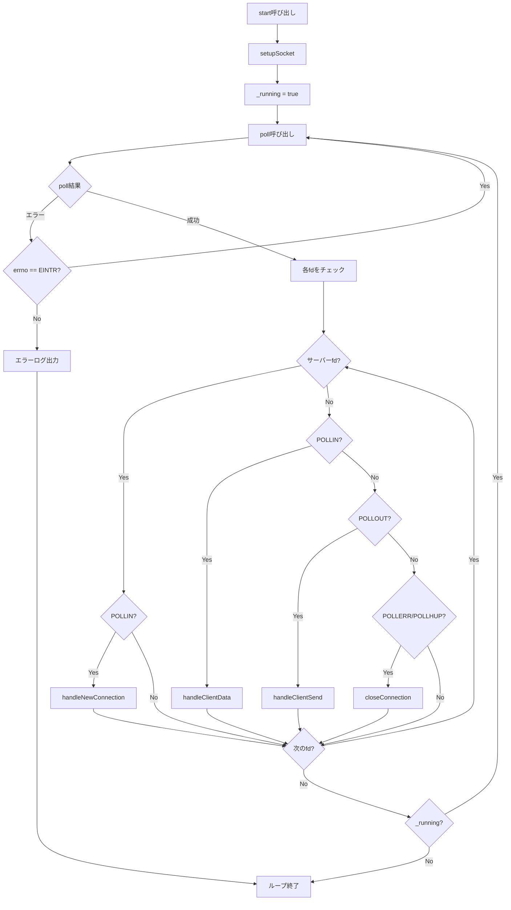
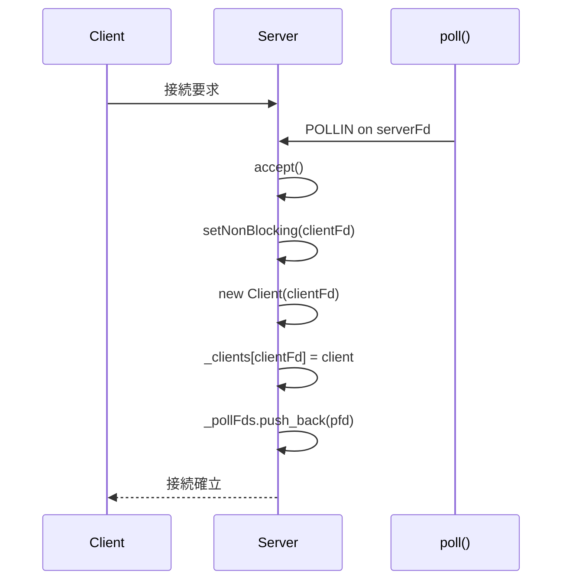

# Serverクラス詳細

このドキュメントでは、ft_ircの心臓部である`Server`クラスの詳細な実装を説明します。

## 目次

1. [Serverクラスの概要](#serverクラスの概要)
2. [メンバー変数](#メンバー変数)
3. [初期化とセットアップ](#初期化とセットアップ)
4. [イベントループ](#イベントループ)
5. [接続管理](#接続管理)
6. [クライアント管理](#クライアント管理)
7. [チャンネル管理](#チャンネル管理)
8. [実装のポイント](#実装のポイント)

---

## Serverクラスの概要

`Server`クラスは、IRCサーバーの中核となるクラスで、以下の責務を持ちます：

- 🎯 ソケットの作成とバインド
- 🎯 poll()によるイベント監視
- 🎯 新規接続の受け入れ
- 🎯 クライアントとチャンネルの管理
- 🎯 メッセージのルーティング

### クラス定義（推定）

```cpp
#ifndef SERVER_HPP
# define SERVER_HPP

# include <string>
# include <vector>
# include <map>
# include <poll.h>

class Client;
class Channel;
class CommandHandler;

class Server {
private:
    // ソケット関連
    int                             _serverFd;      // サーバーソケットのfd
    int                             _port;          // ポート番号
    std::string                     _password;      // サーバーパスワード
    
    // poll()関連
    std::vector<struct pollfd>      _pollFds;       // poll用のfd配列
    
    // リソース管理
    std::map<int, Client*>          _clients;       // fd -> Client
    std::map<std::string, Channel*> _channels;      // name -> Channel
    
    // コマンド処理
    CommandHandler*                 _commandHandler; // コマンドハンドラ
    
    // 状態管理
    bool                            _running;       // サーバー実行中か

public:
    // コンストラクタ・デストラクタ
    Server(int port, const std::string& password);
    ~Server();

    // サーバー操作
    void start();
    void stop();
    bool isRunning() const;

    // クライアント管理
    Client* getClient(int fd);
    Client* getClientByNickname(const std::string& nickname);
    void removeClient(int fd, const std::string& reason);
    void disconnectClient(Client* client, const std::string& reason);
    void sendToClient(Client* client, const std::string& message);

    // チャンネル管理
    Channel* getChannel(const std::string& name);
    Channel* createChannel(const std::string& name);
    void removeChannel(const std::string& name);
    void broadcastToClientChannels(Client* client, const std::string& message, 
                                   Client* exclude);

    // Getters
    const std::string& getPassword() const;

private:
    // ソケット操作
    void setupSocket();
    void handleNewConnection();
    void handleClientData(int fd);
    void handleClientSend(int fd);
    void closeConnection(int fd, const std::string& reason = "");

    // ユーティリティ
    void setNonBlocking(int fd);
    void processClientMessage(Client* client, const std::string& message);
};

#endif
```

---

## メンバー変数

### ソケット関連

#### `int _serverFd`
- **役割**: サーバーソケットのファイルディスクリプタ
- **初期値**: -1
- **用途**: 新規接続を受け入れるためのリスニングソケット

#### `int _port`
- **役割**: サーバーがバインドするポート番号
- **範囲**: 1-65535
- **用途**: ソケットのバインド時に使用

#### `std::string _password`
- **役割**: サーバー接続時に必要なパスワード
- **用途**: PASSコマンドでの認証に使用

---

### poll()関連

#### `std::vector<struct pollfd> _pollFds`
- **役割**: poll()で監視するファイルディスクリプタの配列
- **構造**: 
  - インデックス0: サーバーソケット
  - インデックス1以降: クライアントソケット

**pollfd構造体:**
```cpp
struct pollfd {
    int   fd;       // ファイルディスクリプタ
    short events;   // 監視するイベント（POLLIN, POLLOUT）
    short revents;  // 発生したイベント（poll()が設定）
};
```

**使用例:**
```cpp
// サーバーソケットを追加
struct pollfd pfd;
pfd.fd = _serverFd;
pfd.events = POLLIN;  // 新規接続を監視
pfd.revents = 0;
_pollFds.push_back(pfd);

// クライアントソケットを追加
pfd.fd = clientFd;
pfd.events = POLLIN | POLLOUT;  // 読み書き両方を監視
pfd.revents = 0;
_pollFds.push_back(pfd);
```

---

### リソース管理

#### `std::map<int, Client*> _clients`
- **役割**: ファイルディスクリプタからClientオブジェクトへのマッピング
- **キー**: ファイルディスクリプタ（int）
- **値**: Clientオブジェクトへのポインタ
- **用途**: fdからクライアント情報への高速アクセス（O(log n)）

**使用例:**
```cpp
// クライアントの追加
Client* client = new Client(clientFd);
_clients[clientFd] = client;

// クライアントの取得
Client* client = _clients[fd];

// クライアントの削除
_clients.erase(fd);
```

#### `std::map<std::string, Channel*> _channels`
- **役割**: チャンネル名からChannelオブジェクトへのマッピング
- **キー**: チャンネル名（std::string）
- **値**: Channelオブジェクトへのポインタ
- **用途**: チャンネル名からチャンネル情報への高速アクセス

**使用例:**
```cpp
// チャンネルの作成
Channel* channel = new Channel("#general");
_channels["#general"] = channel;

// チャンネルの取得
Channel* channel = _channels["#general"];

// チャンネルの削除
_channels.erase("#general");
```

---

### その他

#### `CommandHandler* _commandHandler`
- **役割**: コマンド処理を担当するハンドラ
- **初期化**: コンストラクタで作成
- **解放**: デストラクタで削除

#### `bool _running`
- **役割**: サーバーの実行状態
- **true**: サーバー実行中
- **false**: サーバー停止

---

## 初期化とセットアップ

### コンストラクタ

```cpp
Server::Server(int port, const std::string& password)
    : _serverFd(-1), _port(port), _password(password), 
      _commandHandler(NULL), _running(false) {
    _commandHandler = new CommandHandler(this);
}
```

**処理内容:**
1. メンバー変数の初期化
2. CommandHandlerの作成（Serverへのポインタを渡す）

⚠️ **注意**: ソケットの作成は`start()`で行います。

---

### デストラクタ

```cpp
Server::~Server() {
    stop();  // すべてのリソースを解放
    delete _commandHandler;
}
```

**処理内容:**
1. `stop()`を呼び出してリソースを解放
2. CommandHandlerを削除

---

### setupSocket() - ソケットのセットアップ

```cpp
void Server::setupSocket() {
    // 1. ソケットの作成
    _serverFd = socket(AF_INET, SOCK_STREAM, 0);
    if (_serverFd < 0)
        throw std::runtime_error("Error: socket creation failed");

    // 2. ソケットオプションの設定（SO_REUSEADDR）
    int opt = 1;
    if (setsockopt(_serverFd, SOL_SOCKET, SO_REUSEADDR, &opt, sizeof(opt)) < 0) {
        close(_serverFd);
        throw std::runtime_error("Error: setsockopt failed");
    }

    // 3. 非ブロッキングモードに設定
    setNonBlocking(_serverFd);

    // 4. アドレス構造体の準備
    struct sockaddr_in addr;
    std::memset(&addr, 0, sizeof(addr));
    addr.sin_family = AF_INET;
    addr.sin_addr.s_addr = INADDR_ANY;  // すべてのインターフェースで待機
    addr.sin_port = htons(_port);       // ホストバイトオーダーからネットワークバイトオーダーへ

    // 5. バインド
    if (bind(_serverFd, (struct sockaddr*)&addr, sizeof(addr)) < 0) {
        close(_serverFd);
        throw std::runtime_error("Error: bind failed");
    }

    // 6. リスニング開始
    if (listen(_serverFd, SOMAXCONN) < 0) {
        close(_serverFd);
        throw std::runtime_error("Error: listen failed");
    }

    // 7. poll配列に追加
    struct pollfd pfd;
    pfd.fd = _serverFd;
    pfd.events = POLLIN;  // 新規接続を監視
    pfd.revents = 0;
    _pollFds.push_back(pfd);
}
```

#### 各ステップの詳細

##### 1. socket() - ソケットの作成

```cpp
int socket(int domain, int type, int protocol);
```

- `AF_INET`: IPv4アドレスファミリー
- `SOCK_STREAM`: TCP（ストリーム型）
- `0`: プロトコル（自動選択）

##### 2. setsockopt() - SO_REUSEADDR

```cpp
int setsockopt(int sockfd, int level, int optname, const void *optval, socklen_t optlen);
```

**SO_REUSEADDRの効果:**
- サーバー再起動時に「Address already in use」エラーを防ぐ
- TIME_WAIT状態のポートを再利用可能にする

##### 3. setNonBlocking() - 非ブロッキング設定

```cpp
void Server::setNonBlocking(int fd) {
    fcntl(fd, F_SETFL, O_NONBLOCK);
}
```

⚠️ **重要**: ft_ircプロジェクトでは、fcntl()はこの用途のみに使用できます。

##### 4. sockaddr_in - アドレス構造体

```cpp
struct sockaddr_in {
    sa_family_t    sin_family;  // AF_INET
    in_port_t      sin_port;    // ポート番号（ネットワークバイトオーダー）
    struct in_addr sin_addr;    // IPアドレス
};
```

- `INADDR_ANY`: すべてのネットワークインターフェースで待機（0.0.0.0）
- `htons()`: ホストバイトオーダーからネットワークバイトオーダーへ変換

##### 5. bind() - ソケットとアドレスの紐付け

ソケットを特定のIPアドレスとポートに紐付けます。

##### 6. listen() - リスニング開始

```cpp
int listen(int sockfd, int backlog);
```

- `SOMAXCONN`: システムが許可する最大接続待ちキュー数

##### 7. pollに追加

サーバーソケットをpoll配列に追加して、新規接続を監視できるようにします。

---

## イベントループ

### start() - メインループ

```cpp
void Server::start() {
    setupSocket();  // ソケットのセットアップ
    _running = true;

    std::cout << "IRC Server started on port " << _port << std::endl;

    while (_running) {
        // poll()を呼び出す
        int pollCount = poll(&_pollFds[0], _pollFds.size(), -1);

        // エラーチェック
        if (pollCount < 0) {
            if (errno == EINTR)
                continue;  // シグナルで中断された場合は再試行
            std::cerr << "Error: poll failed: " << strerror(errno) << std::endl;
            break;
        }

        // イベントが発生したファイルディスクリプタを処理
        for (size_t i = 0; i < _pollFds.size(); ++i) {
            if (_pollFds[i].revents == 0)
                continue;  // イベントなし

            if (_pollFds[i].fd == _serverFd) {
                // サーバーソケット: 新規接続
                if (_pollFds[i].revents & POLLIN)
                    handleNewConnection();
            } else {
                // クライアントソケット
                if (_pollFds[i].revents & POLLIN)
                    handleClientData(_pollFds[i].fd);
                if (_pollFds[i].revents & POLLOUT)
                    handleClientSend(_pollFds[i].fd);
                if (_pollFds[i].revents & (POLLERR | POLLHUP | POLLNVAL))
                    closeConnection(_pollFds[i].fd);
            }
        }
    }
}
```

### イベントループのフローチャート



---

## 接続管理

### handleNewConnection() - 新規接続の受け入れ

```cpp
void Server::handleNewConnection() {
    struct sockaddr_in clientAddr;
    socklen_t clientLen = sizeof(clientAddr);

    // 接続を受け入れる
    int clientFd = accept(_serverFd, (struct sockaddr*)&clientAddr, &clientLen);
    if (clientFd < 0) {
        std::cerr << "Error: accept failed: " << strerror(errno) << std::endl;
        return;
    }

    // 非ブロッキングモードに設定
    setNonBlocking(clientFd);

    // Clientオブジェクトを作成
    try {
        Client* client = new Client(clientFd);
        client->setHostname(inet_ntoa(clientAddr.sin_addr));
        _clients[clientFd] = client;

        // poll配列に追加
        struct pollfd pfd;
        pfd.fd = clientFd;
        pfd.events = POLLIN | POLLOUT;  // 読み書き両方を監視
        pfd.revents = 0;
        _pollFds.push_back(pfd);

        std::cout << "New connection from " << inet_ntoa(clientAddr.sin_addr) << std::endl;
    } catch (const std::exception& e) {
        std::cerr << "Error: Failed to create client (memory allocation failed): " 
                  << e.what() << std::endl;
        close(clientFd);
    }
}
```

#### 処理の流れ



---

### handleClientData() - クライアントからのデータ受信

```cpp
void Server::handleClientData(int fd) {
    Client* client = getClient(fd);
    if (!client)
        return;

    char buffer[512];
    ssize_t bytes = recv(fd, buffer, sizeof(buffer) - 1, 0);

    if (bytes <= 0) {
        if (bytes == 0) {
            std::cout << "Client disconnected (fd: " << fd << ")" << std::endl;
            closeConnection(fd, "Connection closed");
        } else {
            std::cerr << "Error: recv failed: " << strerror(errno) << std::endl;
            closeConnection(fd, "Read error");
        }
        return;
    }

    buffer[bytes] = '\0';
    client->appendRecvBuffer(std::string(buffer, bytes));

    // 完全なメッセージ（\r\nまで）を処理
    while (true) {
        Client* current = getClient(fd);
        if (!current || !current->hasCompleteMessage())
            break;

        std::string message = current->extractMessage();
        if (!message.empty())
            processClientMessage(current, message);
    }
}
```

#### 重要なポイント

##### 1. バッファサイズ

```cpp
char buffer[512];
```

IRCメッセージの最大長は512バイト（\r\n含む）です。

##### 2. recv()の戻り値

- `> 0`: 受信したバイト数
- `0`: 接続が閉じられた
- `-1`: エラー（errno を確認）

##### 3. 部分受信への対応

```cpp
client->appendRecvBuffer(std::string(buffer, bytes));
```

受信したデータをバッファに追加し、`\r\n`が揃うまで蓄積します。

##### 4. 複数メッセージの処理

```cpp
while (true) {
    if (!current->hasCompleteMessage())
        break;
    std::string message = current->extractMessage();
    processClientMessage(current, message);
}
```

1回の受信で複数のメッセージが来る可能性があるため、ループで処理します。

---

### handleClientSend() - クライアントへのデータ送信

```cpp
void Server::handleClientSend(int fd) {
    Client* client = getClient(fd);
    if (!client || client->getSendBuffer().empty())
        return;

    const std::string& buffer = client->getSendBuffer();
    ssize_t bytes = send(fd, buffer.c_str(), buffer.size(), 0);

    if (bytes < 0) {
        if (errno != EAGAIN && errno != EWOULDBLOCK) {
            std::cerr << "Error: send failed: " << strerror(errno) << std::endl;
            closeConnection(fd, "Send error");
        }
        return;  // EAGAIN/EWOULDBLOCKの場合は次のpoll()で再試行
    }

    client->clearSendBuffer(bytes);  // 送信済みの部分を削除
}
```

#### 重要なポイント

##### 1. 送信バッファのチェック

```cpp
if (!client || client->getSendBuffer().empty())
    return;
```

送信するデータがない場合は何もしません。

##### 2. 部分送信への対応

```cpp
ssize_t bytes = send(fd, buffer.c_str(), buffer.size(), 0);
client->clearSendBuffer(bytes);  // 送信できた分だけ削除
```

send()は要求したサイズより少ないバイト数しか送信できないことがあります。
送信できた分だけバッファから削除し、残りは次回のPOLLOUTで送信します。

##### 3. EAGAIN/EWOULDBLOCKの処理

```cpp
if (errno != EAGAIN && errno != EWOULDBLOCK) {
    // 実際のエラー
    closeConnection(fd, "Send error");
}
// EAGAIN/EWOULDBLOCKの場合は次のpoll()で再試行
```

非ブロッキングモードでは、送信バッファが満杯の場合にEAGAINが返されます。
これはエラーではなく、次のPOLLOUTイベントで再試行します。

---

### closeConnection() - 接続のクローズ

```cpp
void Server::closeConnection(int fd, const std::string& reason) {
    close(fd);
    removeClient(fd, reason);
}
```

単純にソケットを閉じて、クライアントを削除します。

---

## クライアント管理

### getClient() - fdからClientを取得

```cpp
Client* Server::getClient(int fd) {
    std::map<int, Client*>::iterator it = _clients.find(fd);
    if (it != _clients.end())
        return it->second;
    return NULL;
}
```

**時間計算量**: O(log n)

---

### getClientByNickname() - ニックネームからClientを取得

```cpp
Client* Server::getClientByNickname(const std::string& nickname) {
    for (std::map<int, Client*>::iterator it = _clients.begin(); 
         it != _clients.end(); ++it) {
        if (it->second->getNickname() == nickname)
            return it->second;
    }
    return NULL;
}
```

**時間計算量**: O(n)

💡 **最適化の余地**: ニックネームをキーとする別のmapを持つことで、O(log n)に改善できます。

---

### removeClient() - クライアントの削除

```cpp
void Server::removeClient(int fd, const std::string& reason) {
    Client* client = getClient(fd);
    if (!client)
        return;

    // QUITメッセージをブロードキャスト
    std::string quitReason = reason.empty() ? "Client disconnected" : reason;
    std::string quitMsg = ":" + client->getPrefix() + " QUIT :" + quitReason + "\r\n";
    broadcastToClientChannels(client, quitMsg, client);

    // すべてのチャンネルから削除
    for (std::map<std::string, Channel*>::iterator it = _channels.begin(); 
         it != _channels.end(); ) {
        Channel* channel = it->second;
        if (channel->isMember(client)) {
            channel->removeMember(client);
        }

        // 空のチャンネルを削除
        if (channel->getMemberCount() == 0) {
            delete channel;
            _channels.erase(it++);  // 後置インクリメントで安全に削除
        } else {
            ++it;
        }
    }

    // クライアントリストから削除
    _clients.erase(fd);
    delete client;

    // poll配列から削除
    for (std::vector<struct pollfd>::iterator it = _pollFds.begin(); 
         it != _pollFds.end(); ++it) {
        if (it->fd == fd) {
            _pollFds.erase(it);
            break;
        }
    }
}
```

#### 処理の流れ

1. QUITメッセージをブロードキャスト
2. すべてのチャンネルから削除
3. 空のチャンネルを削除
4. クライアントリストから削除
5. Clientオブジェクトを削除
6. poll配列から削除

⚠️ **注意**: イテレータを無効化しないよう、`erase(it++)`を使用しています。

---

### sendToClient() - クライアントにメッセージを送信

```cpp
void Server::sendToClient(Client* client, const std::string& message) {
    if (client)
        client->appendSendBuffer(message);
}
```

メッセージを送信バッファに追加します。実際の送信は`handleClientSend()`で行われます。

---

## チャンネル管理

### getChannel() - チャンネルを取得

```cpp
Channel* Server::getChannel(const std::string& name) {
    std::map<std::string, Channel*>::iterator it = _channels.find(name);
    if (it != _channels.end())
        return it->second;
    return NULL;
}
```

---

### createChannel() - チャンネルを作成

```cpp
Channel* Server::createChannel(const std::string& name) {
    Channel* channel = getChannel(name);
    if (!channel) {
        channel = new Channel(name);
        _channels[name] = channel;
    }
    return channel;
}
```

既に存在する場合は既存のチャンネルを返します。

---

### removeChannel() - チャンネルを削除

```cpp
void Server::removeChannel(const std::string& name) {
    std::map<std::string, Channel*>::iterator it = _channels.find(name);
    if (it != _channels.end()) {
        delete it->second;
        _channels.erase(it);
    }
}
```

---

### broadcastToClientChannels() - クライアントが参加しているチャンネルにブロードキャスト

```cpp
void Server::broadcastToClientChannels(Client* client, const std::string& message, 
                                      Client* exclude) {
    if (!client)
        return;
    
    std::set<Client*> delivered;  // 重複送信を防ぐ
    if (exclude)
        delivered.insert(exclude);
    
    for (std::map<std::string, Channel*>::iterator it = _channels.begin(); 
         it != _channels.end(); ++it) {
        Channel* channel = it->second;
        if (!channel->isMember(client))
            continue;
        
        const std::vector<Client*>& members = channel->getMembers();
        for (std::vector<Client*>::const_iterator mit = members.begin(); 
             mit != members.end(); ++mit) {
            Client* member = *mit;
            if (delivered.insert(member).second)  // 初めて送信する場合のみ
                member->appendSendBuffer(message);
        }
    }
}
```

#### 重要なポイント

##### 重複送信の防止

```cpp
std::set<Client*> delivered;
if (delivered.insert(member).second)  // insertの戻り値のsecondがtrueなら初めて
    member->appendSendBuffer(message);
```

クライアントが複数のチャンネルに参加している場合、同じメッセージを複数回送信しないようにします。

---

## 実装のポイント

### 1. poll()は1つだけ

✅ **正しい実装:**
```cpp
while (_running) {
    int result = poll(&_pollFds[0], _pollFds.size(), -1);
    // すべてのイベントを処理
}
```

❌ **間違った実装:**
```cpp
// 複数のpoll()を使用（禁止）
poll(&read_fds[0], read_fds.size(), -1);
poll(&write_fds[0], write_fds.size(), -1);
```

---

### 2. イテレータの安全な使用

✅ **正しい実装:**
```cpp
for (std::map<std::string, Channel*>::iterator it = _channels.begin(); 
     it != _channels.end(); ) {
    if (shouldDelete(it->second)) {
        delete it->second;
        _channels.erase(it++);  // 後置インクリメント
    } else {
        ++it;
    }
}
```

❌ **間違った実装:**
```cpp
for (std::map<std::string, Channel*>::iterator it = _channels.begin(); 
     it != _channels.end(); ++it) {
    if (shouldDelete(it->second)) {
        _channels.erase(it);  // イテレータが無効化される
        // ここで++itするとクラッシュ
    }
}
```

---

### 3. メモリリーク防止

✅ **リソースの確実な解放:**
```cpp
Server::~Server() {
    stop();  // すべてのリソースを解放
    delete _commandHandler;
}

void Server::stop() {
    // クライアントの解放
    for (std::map<int, Client*>::iterator it = _clients.begin(); 
         it != _clients.end(); ++it) {
        close(it->first);
        delete it->second;
    }
    _clients.clear();
    
    // チャンネルの解放
    for (std::map<std::string, Channel*>::iterator it = _channels.begin(); 
         it != _channels.end(); ++it) {
        delete it->second;
    }
    _channels.clear();
}
```

---

### 4. 例外安全性

```cpp
try {
    Client* client = new Client(clientFd);
    _clients[clientFd] = client;
} catch (const std::exception& e) {
    std::cerr << "Error: Failed to create client: " << e.what() << std::endl;
    close(clientFd);  // fdをクローズ
}
```

メモリ確保に失敗した場合でも、ファイルディスクリプタをクローズします。

---

## まとめ

### Serverクラスの責務

✅ **ソケット管理**: 作成、バインド、リスニング
✅ **イベント監視**: poll()による非ブロッキングI/O
✅ **接続管理**: 新規接続の受け入れ、切断処理
✅ **リソース管理**: クライアントとチャンネルの管理
✅ **メッセージルーティング**: 受信、処理、送信

### 次のステップ

- [04_CLIENT_CLASS.md](04_CLIENT_CLASS.md) - Clientクラスの詳細
- [05_CHANNEL_CLASS.md](05_CHANNEL_CLASS.md) - Channelクラスの詳細
- [09_DATA_FLOW.md](09_DATA_FLOW.md) - データフローの詳細

---

**前のドキュメント**: [02_ARCHITECTURE.md](02_ARCHITECTURE.md)
**次のドキュメント**: [04_CLIENT_CLASS.md](04_CLIENT_CLASS.md)

