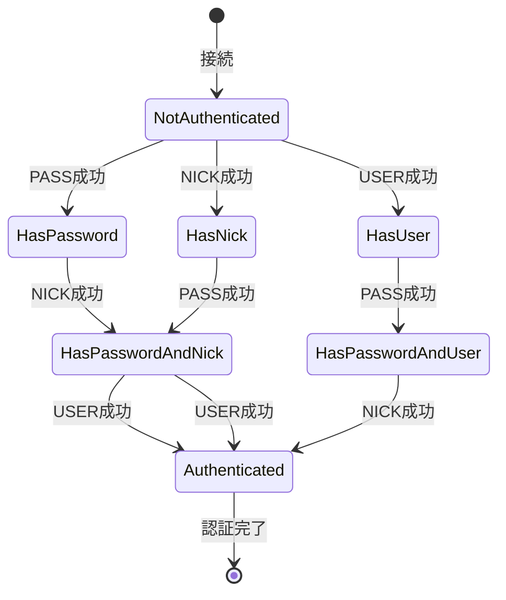
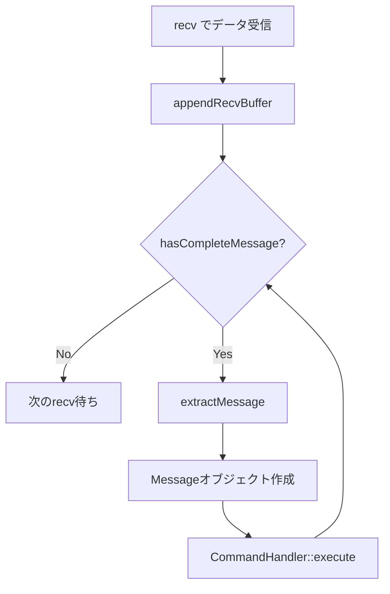

# Client クラス詳細

このドキュメントでは、個々のクライアントの状態を管理する`Client`クラスの詳細な実装を説明します。

## 目次

1. [Client クラスの概要](#clientクラスの概要)
2. [メンバー変数](#メンバー変数)
3. [認証フロー](#認証フロー)
4. [バッファ管理](#バッファ管理)
5. [メッセージの抽出](#メッセージの抽出)
6. [実装例とエッジケース](#実装例とエッジケース)

---

## Client クラスの概要

`Client`クラスは、IRC サーバーに接続している個々のクライアントの情報と状態を管理します。

### 主な責務

- 🎯 クライアント情報の保持（ニックネーム、ユーザー名など）
- 🎯 認証状態の管理
- 🎯 受信バッファの管理（部分受信対応）
- 🎯 送信バッファの管理（部分送信対応）
- 🎯 完全なメッセージの抽出

### クラス定義

```cpp
class Client {
private:
    int         _fd;              // ファイルディスクリプタ
    std::string _nickname;        // ニックネーム
    std::string _username;        // ユーザー名
    std::string _hostname;        // ホスト名
    std::string _realname;        // 実名
    std::string _recvBuffer;      // 受信バッファ
    std::string _sendBuffer;      // 送信バッファ
    bool        _isAuthenticated; // 認証済みか
    bool        _hasPassword;     // PASSコマンド受信済みか
    bool        _hasNick;         // NICKコマンド受信済みか
    bool        _hasUser;         // USERコマンド受信済みか

public:
    // コンストラクタ・デストラクタ
    Client(int fd);
    ~Client();

    // Getters
    int                 getFd() const;
    const std::string&  getNickname() const;
    const std::string&  getUsername() const;
    const std::string&  getHostname() const;
    const std::string&  getRealname() const;
    const std::string&  getRecvBuffer() const;
    const std::string&  getSendBuffer() const;
    bool                isAuthenticated() const;
    bool                hasPassword() const;
    bool                hasNick() const;
    bool                hasUser() const;

    // Setters
    void setNickname(const std::string& nickname);
    void setUsername(const std::string& username);
    void setHostname(const std::string& hostname);
    void setRealname(const std::string& realname);
    void setPassword(bool status);
    void setAuthenticated(bool status);

    // バッファ管理
    void        appendRecvBuffer(const std::string& data);
    void        appendSendBuffer(const std::string& data);
    void        clearRecvBuffer();
    void        clearSendBuffer(size_t len);
    bool        hasCompleteMessage() const;
    std::string extractMessage();

    // ユーティリティ
    std::string getPrefix() const;
};
```

---

## メンバー変数

### 基本情報

#### `int _fd`

- **役割**: クライアントのソケットのファイルディスクリプタ
- **用途**: recv/send での通信、poll()での監視

#### `std::string _nickname`

- **役割**: クライアントのニックネーム
- **制約**:
  - 1-9 文字
  - 最初の文字は英字または `_`
  - 2 文字目以降は英数字、`_`、`-`
  - サーバー内で一意

#### `std::string _username`

- **役割**: クライアントのユーザー名
- **設定**: USER コマンドで設定

#### `std::string _hostname`

- **役割**: クライアントのホスト名または IP アドレス
- **設定**: 接続時に自動設定（`inet_ntoa()`）

#### `std::string _realname`

- **役割**: クライアントの実名
- **設定**: USER コマンドの trailing パラメータで設定

---

### バッファ

#### `std::string _recvBuffer`

- **役割**: 受信したデータを蓄積するバッファ
- **用途**: `\r\n`が揃うまでデータを保持

**動作例:**

```
受信1: "PRIVMSG #ge"
_recvBuffer = "PRIVMSG #ge"

受信2: "neral :Hello\r\n"
_recvBuffer = "PRIVMSG #general :Hello\r\n"

extractMessage()
→ "PRIVMSG #general :Hello"
_recvBuffer = ""
```

#### `std::string _sendBuffer`

- **役割**: 送信待ちのデータを蓄積するバッファ
- **用途**: 部分送信に対応

**動作例:**

```
appendSendBuffer(":server 001 alice :Welcome\r\n")
_sendBuffer = ":server 001 alice :Welcome\r\n"

send() → 20バイト送信成功
clearSendBuffer(20)
_sendBuffer = "ome\r\n"  // 残りのデータ

次のPOLLOUT時に残りを送信
```

---

### 認証状態

#### `bool _isAuthenticated`

- **役割**: 認証が完了したかどうか
- **true**: PASS, NICK, USER がすべて完了
- **false**: まだ認証中

#### `bool _hasPassword`

- **役割**: PASS コマンドを受信し、パスワードが正しいか
- **設定**: `handlePass()`で設定

#### `bool _hasNick`

- **役割**: NICK コマンドを受信し、ニックネームが設定されたか
- **設定**: `setNickname()`で自動的に true になる

#### `bool _hasUser`

- **役割**: USER コマンドを受信し、ユーザー情報が設定されたか
- **設定**: `setRealname()`で自動的に true になる

---

## 認証フロー

### 認証の 3 ステップ



### 実装例

```cpp
Client::Client(int fd)
    : _fd(fd), _isAuthenticated(false),
      _hasPassword(false), _hasNick(false), _hasUser(false) {
}

void Client::setNickname(const std::string& nickname) {
    _nickname = nickname;
    _hasNick = true;  // 自動的にtrueに
}

void Client::setRealname(const std::string& realname) {
    _realname = realname;
    _hasUser = true;  // 自動的にtrueに
}

void Client::setPassword(bool status) {
    _hasPassword = status;
}

void Client::setAuthenticated(bool status) {
    _isAuthenticated = status;
}
```

### 認証完了のチェック

```cpp
// CommandHandlerでの使用例
void CommandHandler::handlePass(Client* client, const Message& msg) {
    // ... パスワードチェック ...
    client->setPassword(true);

    // 認証完了をチェック
    if (client->hasPassword() && client->hasNick() && client->hasUser()) {
        client->setAuthenticated(true);
        // RPL_WELCOMEを送信
        std::string welcome = createReply(RPL::WELCOME, client->getNickname(),
            ":Welcome to the Internet Relay Network " + client->getPrefix());
        _server->sendToClient(client, welcome);
    }
}
```

---

## バッファ管理

### 受信バッファ

#### appendRecvBuffer() - データの追加

```cpp
void Client::appendRecvBuffer(const std::string& data) {
    _recvBuffer += data;
}
```

**使用例:**

```cpp
// Server::handleClientData()での使用
char buffer[512];
ssize_t bytes = recv(fd, buffer, sizeof(buffer) - 1, 0);
if (bytes > 0) {
    buffer[bytes] = '\0';
    client->appendRecvBuffer(std::string(buffer, bytes));
}
```

#### hasCompleteMessage() - 完全なメッセージがあるかチェック

```cpp
bool Client::hasCompleteMessage() const {
    return _recvBuffer.find("\r\n") != std::string::npos;
}
```

IRC メッセージは`\r\n`で終了するため、これが含まれているかチェックします。

#### extractMessage() - メッセージの抽出

```cpp
std::string Client::extractMessage() {
    size_t pos = _recvBuffer.find("\r\n");
    if (pos == std::string::npos)
        return "";

    std::string message = _recvBuffer.substr(0, pos);
    _recvBuffer.erase(0, pos + 2);  // \r\nも削除
    return message;
}
```

**動作の詳細:**

```cpp
// 初期状態
_recvBuffer = "PRIVMSG #general :Hello\r\nNICK alice\r\n"

// 1回目のextractMessage()
pos = 23  // "PRIVMSG #general :Hello\r\n"の\r\nの位置
message = "PRIVMSG #general :Hello"
_recvBuffer = "NICK alice\r\n"
return "PRIVMSG #general :Hello"

// 2回目のextractMessage()
pos = 10  // "NICK alice\r\n"の\r\nの位置
message = "NICK alice"
_recvBuffer = ""
return "NICK alice"

// 3回目のextractMessage()
pos = std::string::npos  // \r\nが見つからない
return ""
```

#### clearRecvBuffer() - バッファのクリア

```cpp
void Client::clearRecvBuffer() {
    _recvBuffer.clear();
}
```

通常は使用しませんが、エラー時などにバッファをリセットする場合に使用します。

---

### 送信バッファ

#### appendSendBuffer() - データの追加

```cpp
void Client::appendSendBuffer(const std::string& data) {
    _sendBuffer += data;
}
```

**使用例:**

```cpp
// Server::sendToClient()での使用
void Server::sendToClient(Client* client, const std::string& message) {
    if (client)
        client->appendSendBuffer(message);
}
```

#### clearSendBuffer() - 送信済みデータの削除

```cpp
void Client::clearSendBuffer(size_t len) {
    _sendBuffer.erase(0, len);
}
```

**使用例:**

```cpp
// Server::handleClientSend()での使用
const std::string& buffer = client->getSendBuffer();
ssize_t bytes = send(fd, buffer.c_str(), buffer.size(), 0);

if (bytes > 0) {
    client->clearSendBuffer(bytes);  // 送信できた分だけ削除
}
```

**動作の詳細:**

```cpp
// 初期状態
_sendBuffer = ":server 001 alice :Welcome\r\n:server 002 alice :Host\r\n"

// send()で30バイト送信成功
clearSendBuffer(30)
_sendBuffer = ":server 002 alice :Host\r\n"

// 次のPOLLOUTで残りを送信
```

---

## メッセージの抽出

### 完全な処理フロー



### 実装例

```cpp
void Server::handleClientData(int fd) {
    Client* client = getClient(fd);
    if (!client)
        return;

    // データ受信
    char buffer[512];
    ssize_t bytes = recv(fd, buffer, sizeof(buffer) - 1, 0);
    if (bytes <= 0) {
        closeConnection(fd);
        return;
    }

    // バッファに追加
    buffer[bytes] = '\0';
    client->appendRecvBuffer(std::string(buffer, bytes));

    // 完全なメッセージを処理
    while (true) {
        Client* current = getClient(fd);
        if (!current || !current->hasCompleteMessage())
            break;

        std::string message = current->extractMessage();
        if (!message.empty())
            processClientMessage(current, message);
    }
}
```

---

## 実装例とエッジケース

### エッジケース 1: 部分受信

**シナリオ**: 1 つのメッセージが複数回に分けて受信される

```cpp
// 1回目の受信
recv() → "PRIVMSG #ge"
appendRecvBuffer("PRIVMSG #ge")
hasCompleteMessage() → false  // \r\nがない
// 処理せずに待機

// 2回目の受信
recv() → "neral :Hello\r\n"
appendRecvBuffer("neral :Hello\r\n")
_recvBuffer = "PRIVMSG #general :Hello\r\n"
hasCompleteMessage() → true
extractMessage() → "PRIVMSG #general :Hello"
// 処理実行
```

---

### エッジケース 2: 複数メッセージの同時受信

**シナリオ**: 1 回の受信で複数のメッセージが来る

```cpp
// 1回の受信
recv() → "NICK alice\r\nUSER alice 0 * :Alice\r\n"
appendRecvBuffer("NICK alice\r\nUSER alice 0 * :Alice\r\n")

// whileループで処理
// 1回目
hasCompleteMessage() → true
extractMessage() → "NICK alice"
_recvBuffer = "USER alice 0 * :Alice\r\n"
// NICK処理

// 2回目
hasCompleteMessage() → true
extractMessage() → "USER alice 0 * :Alice"
_recvBuffer = ""
// USER処理

// 3回目
hasCompleteMessage() → false
// ループ終了
```

---

### エッジケース 3: 部分送信

**シナリオ**: send()が要求より少ないバイト数しか送信できない

```cpp
// 送信データ
appendSendBuffer(":server 001 alice :Welcome to IRC\r\n")  // 36バイト
_sendBuffer = ":server 001 alice :Welcome to IRC\r\n"

// 1回目の送信
send(fd, _sendBuffer.c_str(), 36, 0) → 20  // 20バイトのみ送信
clearSendBuffer(20)
_sendBuffer = "me to IRC\r\n"  // 残り16バイト

// 2回目の送信（次のPOLLOUT時）
send(fd, _sendBuffer.c_str(), 16, 0) → 16  // 残り全部送信
clearSendBuffer(16)
_sendBuffer = ""  // 完了
```

---

### エッジケース 4: 最大メッセージ長

**シナリオ**: IRC メッセージの最大長（512 バイト）を超える場合

```cpp
// 受信バッファが512バイトを超えた場合の処理
void Client::appendRecvBuffer(const std::string& data) {
    _recvBuffer += data;

    // オプション: 最大長チェック
    if (_recvBuffer.size() > 512) {
        // エラー処理または切り詰め
        _recvBuffer.clear();
    }
}
```

💡 **実装のヒント**: 実際の IRC サーバーでは、512 バイトを超えるメッセージは切り詰めるか、エラーとして扱います。

---

### エッジケース 5: 認証前のコマンド

**シナリオ**: 認証完了前に認証以外のコマンドを送信

```cpp
void CommandHandler::execute(Client* client, const Message& msg) {
    std::string command = msg.getCommand();

    // 認証前でも許可されるコマンド
    if (command == "PASS" || command == "NICK" ||
        command == "USER" || command == "PING" || command == "QUIT") {
        // 処理を続行
    }
    // 認証が必要なコマンド
    else if (!client->isAuthenticated()) {
        _server->sendToClient(client,
            createReply(ERR::NOTREGISTERED, "*", ":You have not registered"));
        return;
    }
    // ...
}
```

---

## ユーティリティメソッド

### getPrefix() - IRC プレフィックスの生成

```cpp
std::string Client::getPrefix() const {
    std::ostringstream oss;
    oss << _nickname;
    if (!_username.empty())
        oss << "!" << _username;
    if (!_hostname.empty())
        oss << "@" << _hostname;
    return oss.str();
}
```

**出力例:**

```cpp
// ニックネームのみ
_nickname = "alice"
getPrefix() → "alice"

// ニックネーム + ユーザー名
_nickname = "alice"
_username = "alice"
getPrefix() → "alice!alice"

// 完全な形式
_nickname = "alice"
_username = "alice"
_hostname = "192.168.1.100"
getPrefix() → "alice!alice@192.168.1.100"
```

**使用例:**

```cpp
// QUITメッセージの生成
std::string quitMsg = ":" + client->getPrefix() + " QUIT :Leaving\r\n";
// → ":alice!alice@192.168.1.100 QUIT :Leaving\r\n"
```

---

## パフォーマンスの考慮

### メモリ効率

#### string::erase()の使用

```cpp
// ✅ 効率的: 先頭から削除
_recvBuffer.erase(0, pos + 2);

// ❌ 非効率: 新しいstringを作成
_recvBuffer = _recvBuffer.substr(pos + 2);
```

`erase()`は内部バッファを再利用するため、`substr()`より効率的です。

#### string::find()の時間計算量

```cpp
bool hasCompleteMessage() const {
    return _recvBuffer.find("\r\n") != std::string::npos;
}
```

- **時間計算量**: O(n)（n はバッファのサイズ）
- **最適化**: 毎回呼び出すのではなく、データ追加時にチェックすることも可能

---

### バッファサイズの管理

```cpp
// 送信バッファが大きくなりすぎないようにチェック
void Client::appendSendBuffer(const std::string& data) {
    if (_sendBuffer.size() + data.size() > MAX_BUFFER_SIZE) {
        // バッファオーバーフロー対策
        // オプション1: 古いデータを削除
        // オプション2: エラーを返す
        // オプション3: 接続を切断
    }
    _sendBuffer += data;
}
```

---

## まとめ

### Client クラスの責務

✅ **クライアント情報**: ニックネーム、ユーザー名、ホスト名、実名
✅ **認証状態**: PASS, NICK, USER の完了状態を管理
✅ **受信バッファ**: 部分受信に対応し、完全なメッセージを抽出
✅ **送信バッファ**: 部分送信に対応し、送信待ちデータを管理
✅ **プレフィックス生成**: IRC メッセージのプレフィックスを生成

### 重要なポイント

📌 **部分送受信への対応**: バッファを使用して、データが分割されても正しく処理
📌 **認証状態の管理**: 3 つのフラグで認証の進行状況を追跡
📌 **メモリ効率**: erase()を使用して効率的にバッファを管理
📌 **エラー処理**: 各メソッドで適切なエラーチェックを実施

### 次のステップ

- [05_CHANNEL_CLASS.md](05_CHANNEL_CLASS.md) - Channel クラスの詳細
- [08_COMMANDS_DETAIL.md](08_COMMANDS_DETAIL.md) - 認証コマンドの実装詳細
- [09_DATA_FLOW.md](09_DATA_FLOW.md) - クライアントのデータフロー

---

**前のドキュメント**: [03_SERVER_CLASS.md](03_SERVER_CLASS.md)
**次のドキュメント**: [05_CHANNEL_CLASS.md](05_CHANNEL_CLASS.md)
