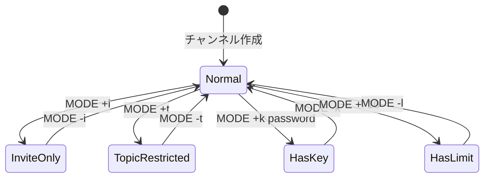

# Channelクラス詳細

このドキュメントでは、IRCチャンネルを管理する`Channel`クラスの詳細な実装を説明します。

## 目次

1. [Channelクラスの概要](#channelクラスの概要)
2. [メンバー変数](#メンバー変数)
3. [チャンネルモード](#チャンネルモード)
4. [メンバー管理](#メンバー管理)
5. [オペレーター管理](#オペレーター管理)
6. [招待システム](#招待システム)
7. [ブロードキャスト機能](#ブロードキャスト機能)
8. [実装パターンと注意点](#実装パターンと注意点)

---

## Channelクラスの概要

`Channel`クラスは、IRCチャンネルの状態とメンバーを管理します。

### 主な責務

- 🎯 チャンネルメンバーの管理
- 🎯 オペレーター権限の管理
- 🎯 チャンネルモードの管理（i, t, k, o, l）
- 🎯 トピックの管理
- 🎯 招待システムの管理
- 🎯 メッセージのブロードキャスト

### クラス定義

```cpp
class Channel {
private:
    std::string              _name;           // チャンネル名
    std::string              _topic;          // トピック
    std::string              _key;            // チャンネルキー（パスワード）
    size_t                   _userLimit;      // ユーザー数制限
    bool                     _inviteOnly;     // 招待制モード
    bool                     _topicRestricted; // トピック制限モード
    std::vector<Client*>     _members;        // メンバーリスト
    std::set<Client*>        _operators;      // オペレーターリスト
    std::set<std::string>    _invitedUsers;   // 招待済みユーザー

public:
    // コンストラクタ・デストラクタ
    Channel(const std::string& name);
    ~Channel();

    // Getters
    const std::string&          getName() const;
    const std::string&          getTopic() const;
    const std::string&          getKey() const;
    size_t                      getUserLimit() const;
    bool                        isInviteOnly() const;
    bool                        isTopicRestricted() const;
    const std::vector<Client*>& getMembers() const;

    // Setters
    void setTopic(const std::string& topic);
    void setKey(const std::string& key);
    void setUserLimit(size_t limit);
    void setInviteOnly(bool status);
    void setTopicRestricted(bool status);

    // メンバー管理
    void   addMember(Client* client);
    void   removeMember(Client* client);
    bool   isMember(Client* client) const;
    bool   isOperator(Client* client) const;
    void   addOperator(Client* client);
    void   removeOperator(Client* client);
    size_t getMemberCount() const;

    // 招待管理
    void addInvite(const std::string& nickname);
    void removeInvite(const std::string& nickname);
    bool isInvited(const std::string& nickname) const;

    // ユーティリティ
    void        broadcast(const std::string& message, Client* exclude = NULL);
    std::string getMemberList() const;
};
```

---

## メンバー変数

### 基本情報

#### `std::string _name`
- **役割**: チャンネル名
- **形式**: `#`または`&`で始まる（例: `#general`）
- **制約**: 
  - 1-50文字
  - スペース、カンマ、コロンを含まない

#### `std::string _topic`
- **役割**: チャンネルのトピック（話題）
- **デフォルト**: 空文字列（トピック未設定）
- **変更**: TOPICコマンドで変更可能

---

### チャンネルモード

#### `bool _inviteOnly`
- **役割**: 招待制モード（+i）
- **true**: 招待されたユーザーのみ参加可能
- **false**: 誰でも参加可能（デフォルト）

#### `bool _topicRestricted`
- **役割**: トピック制限モード（+t）
- **true**: オペレーターのみトピック変更可能（デフォルト）
- **false**: 誰でもトピック変更可能

#### `std::string _key`
- **役割**: チャンネルキー（パスワード）（+k）
- **空文字列**: キーなし（デフォルト）
- **設定時**: JOINコマンドでキーが必要

#### `size_t _userLimit`
- **役割**: ユーザー数制限（+l）
- **0**: 制限なし（デフォルト）
- **> 0**: 指定された人数まで

---

### メンバー管理

#### `std::vector<Client*> _members`
- **役割**: チャンネルメンバーのリスト
- **順序**: 参加順
- **用途**: メンバーの列挙、ブロードキャスト

**使用例:**
```cpp
// メンバーの追加
_members.push_back(client);

// メンバーの検索
std::find(_members.begin(), _members.end(), client);

// メンバーの削除
_members.erase(it);
```

#### `std::set<Client*> _operators`
- **役割**: オペレーター権限を持つメンバーのセット
- **特徴**: 
  - 重複なし
  - 高速検索（O(log n)）
- **用途**: オペレーター権限のチェック

**使用例:**
```cpp
// オペレーターの追加
_operators.insert(client);

// オペレーターのチェック
_operators.find(client) != _operators.end();

// オペレーターの削除
_operators.erase(client);
```

#### `std::set<std::string> _invitedUsers`
- **役割**: 招待されたユーザーのニックネームのセット
- **用途**: 招待制チャンネルへの参加許可チェック
- **削除**: ユーザーが参加したら削除

---

## チャンネルモード

### モード一覧

| モード | 名前 | 説明 | デフォルト |
|--------|------|------|-----------|
| `i` | Invite-only | 招待制 | false |
| `t` | Topic | オペレーターのみトピック変更可 | true |
| `k` | Key | チャンネルキー（パスワード） | なし |
| `o` | Operator | オペレーター権限 | 最初のユーザー |
| `l` | Limit | ユーザー数制限 | 0（無制限） |

### モードの設定と解除



### 実装例

#### コンストラクタ

```cpp
Channel::Channel(const std::string& name) 
    : _name(name), _userLimit(0),
      _inviteOnly(false), _topicRestricted(true) {
}
```

デフォルトでは：
- 招待制: OFF
- トピック制限: ON（オペレーターのみ変更可）
- キー: なし
- ユーザー数制限: なし

---

## メンバー管理

### addMember() - メンバーの追加

```cpp
void Channel::addMember(Client* client) {
    if (!isMember(client))
        _members.push_back(client);
}
```

**重要**: 重複チェックを行い、既にメンバーの場合は追加しません。

---

### removeMember() - メンバーの削除

```cpp
void Channel::removeMember(Client* client) {
    std::vector<Client*>::iterator it = std::find(_members.begin(), _members.end(), client);
    if (it != _members.end())
        _members.erase(it);
    _operators.erase(client);  // オペレーターリストからも削除
}
```

**重要**: オペレーターリストからも同時に削除します。

---

### isMember() - メンバーかどうかチェック

```cpp
bool Channel::isMember(Client* client) const {
    return std::find(_members.begin(), _members.end(), client) != _members.end();
}
```

**時間計算量**: O(n)

---

### getMemberCount() - メンバー数の取得

```cpp
size_t Channel::getMemberCount() const {
    return _members.size();
}
```

**用途**: ユーザー数制限のチェック、空チャンネルの判定

---

## オペレーター管理

### isOperator() - オペレーターかどうかチェック

```cpp
bool Channel::isOperator(Client* client) const {
    return _operators.find(client) != _operators.end();
}
```

**時間計算量**: O(log n)

---

### addOperator() - オペレーター権限の付与

```cpp
void Channel::addOperator(Client* client) {
    if (isMember(client))
        _operators.insert(client);
}
```

**重要**: メンバーでない場合は追加しません。

**使用例:**
```cpp
// チャンネル作成時、最初のユーザーをオペレーターにする
Channel* channel = new Channel("#general");
channel->addMember(client);
channel->addOperator(client);  // 最初のユーザーがオペレーター
```

---

### removeOperator() - オペレーター権限の剥奪

```cpp
void Channel::removeOperator(Client* client) {
    _operators.erase(client);
}
```

**注意**: メンバーリストからは削除しません。

---

### オペレーター権限のチェックパターン

```cpp
// コマンドハンドラでの使用例
void CommandHandler::handleKick(Client* client, const Message& msg) {
    Channel* channel = _server->getChannel(channelName);
    
    // チャンネルに参加しているかチェック
    if (!channel->isMember(client)) {
        _server->sendToClient(client, 
            createReply(ERR::NOTONCHANNEL, client->getNickname(), 
                       channelName + " :You're not on that channel"));
        return;
    }
    
    // オペレーター権限をチェック
    if (!channel->isOperator(client)) {
        _server->sendToClient(client, 
            createReply(ERR::CHANOPRIVSNEEDED, client->getNickname(), 
                       channelName + " :You're not channel operator"));
        return;
    }
    
    // KICKコマンドを実行
    // ...
}
```

---

## 招待システム

### addInvite() - ユーザーを招待

```cpp
void Channel::addInvite(const std::string& nickname) {
    _invitedUsers.insert(nickname);
}
```

**使用例:**
```cpp
// INVITEコマンドの処理
void CommandHandler::handleInvite(Client* client, const Message& msg) {
    // ... バリデーション ...
    
    channel->addInvite(targetNick);
    
    // 招待通知を送信
    std::string inviteMsg = ":" + client->getPrefix() + 
                           " INVITE " + targetNick + " " + channelName + "\r\n";
    _server->sendToClient(targetClient, inviteMsg);
}
```

---

### removeInvite() - 招待を取り消し

```cpp
void Channel::removeInvite(const std::string& nickname) {
    _invitedUsers.erase(nickname);
}
```

**使用例:**
```cpp
// JOINコマンドの処理（招待制チャンネル）
void CommandHandler::handleJoin(Client* client, const Message& msg) {
    // ... バリデーション ...
    
    // 招待されているかチェック
    if (channel->isInviteOnly() && !channel->isInvited(client->getNickname())) {
        _server->sendToClient(client, 
            createReply(ERR::INVITEONLYCHAN, client->getNickname(), 
                       channelName + " :Cannot join channel (+i)"));
        return;
    }
    
    // チャンネルに参加
    channel->addMember(client);
    
    // 招待リストから削除
    if (channel->isInvited(client->getNickname()))
        channel->removeInvite(client->getNickname());
}
```

---

### isInvited() - 招待されているかチェック

```cpp
bool Channel::isInvited(const std::string& nickname) const {
    return _invitedUsers.find(nickname) != _invitedUsers.end();
}
```

**時間計算量**: O(log n)

---

## ブロードキャスト機能

### broadcast() - メッセージのブロードキャスト

```cpp
void Channel::broadcast(const std::string& message, Client* exclude) {
    for (std::vector<Client*>::iterator it = _members.begin(); 
         it != _members.end(); ++it) {
        if (*it != exclude)
            (*it)->appendSendBuffer(message);
    }
}
```

**パラメータ:**
- `message`: ブロードキャストするメッセージ
- `exclude`: 送信を除外するクライアント（通常は送信者自身）

**使用例:**

#### 例1: JOIN通知（送信者を含む）

```cpp
// JOINメッセージをすべてのメンバーに送信（送信者も含む）
std::string joinMsg = ":" + client->getPrefix() + " JOIN " + channelName + "\r\n";
channel->broadcast(joinMsg, NULL);  // excludeなし
```

#### 例2: PRIVMSG（送信者を除く）

```cpp
// PRIVMSGを送信者以外に送信
std::string privMsg = ":" + client->getPrefix() + 
                     " PRIVMSG " + channelName + " :" + message + "\r\n";
channel->broadcast(privMsg, client);  // 送信者を除外
```

#### 例3: PART通知（送信者を含む）

```cpp
// PARTメッセージをすべてのメンバーに送信
std::string partMsg = ":" + client->getPrefix() + 
                     " PART " + channelName + " :" + reason + "\r\n";
channel->broadcast(partMsg, NULL);

// その後メンバーから削除
channel->removeMember(client);
```

---

### getMemberList() - メンバーリストの取得

```cpp
std::string Channel::getMemberList() const {
    std::string list;
    for (std::vector<Client*>::const_iterator it = _members.begin(); 
         it != _members.end(); ++it) {
        if (isOperator(*it))
            list += "@";  // オペレーターには@を付ける
        list += (*it)->getNickname();
        if (it + 1 != _members.end())
            list += " ";  // 最後以外はスペースで区切る
    }
    return list;
}
```

**出力例:**
```
@alice bob charlie @david
```

- `@alice`: オペレーター
- `bob`: 通常メンバー
- `charlie`: 通常メンバー
- `@david`: オペレーター

**使用例:**
```cpp
// NAMESコマンドの応答（RPL_NAMREPLY）
std::string memberList = channel->getMemberList();
std::string reply = createReply(RPL::NAMREPLY, client->getNickname(), 
                               "= " + channelName, ":" + memberList);
_server->sendToClient(client, reply);
```

---

## 実装パターンと注意点

### パターン1: チャンネル参加のバリデーション

```cpp
void CommandHandler::handleJoin(Client* client, const Message& msg) {
    std::string channelName = params[0];
    std::string key = params.size() > 1 ? params[1] : "";
    
    Channel* channel = _server->getChannel(channelName);
    bool isNewChannel = (channel == NULL);
    
    if (isNewChannel) {
        channel = _server->createChannel(channelName);
    }
    
    // 1. 既にメンバーかチェック
    if (channel->isMember(client))
        return;  // 既に参加している
    
    // 2. 招待制チェック
    if (channel->isInviteOnly() && !channel->isInvited(client->getNickname())) {
        _server->sendToClient(client, 
            createReply(ERR::INVITEONLYCHAN, client->getNickname(), 
                       channelName + " :Cannot join channel (+i)"));
        return;
    }
    
    // 3. ユーザー数制限チェック
    if (channel->getUserLimit() > 0 && 
        channel->getMemberCount() >= channel->getUserLimit()) {
        _server->sendToClient(client, 
            createReply(ERR::CHANNELISFULL, client->getNickname(), 
                       channelName + " :Cannot join channel (+l)"));
        return;
    }
    
    // 4. チャンネルキーチェック
    if (!channel->getKey().empty() && channel->getKey() != key) {
        _server->sendToClient(client, 
            createReply(ERR::BADCHANNELKEY, client->getNickname(), 
                       channelName + " :Cannot join channel (+k)"));
        return;
    }
    
    // 5. チャンネルに参加
    channel->addMember(client);
    
    // 6. 新規チャンネルの場合、最初のユーザーをオペレーターにする
    if (isNewChannel)
        channel->addOperator(client);
    
    // 7. 招待リストから削除
    if (channel->isInvited(client->getNickname()))
        channel->removeInvite(client->getNickname());
    
    // 8. JOIN通知をブロードキャスト
    std::string joinMsg = ":" + client->getPrefix() + " JOIN " + channelName + "\r\n";
    channel->broadcast(joinMsg, NULL);
}
```

---

### パターン2: 空チャンネルの削除

```cpp
// Server::removeClient()での使用
void Server::removeClient(int fd, const std::string& reason) {
    Client* client = getClient(fd);
    if (!client)
        return;
    
    // すべてのチャンネルから削除
    for (std::map<std::string, Channel*>::iterator it = _channels.begin(); 
         it != _channels.end(); ) {
        Channel* channel = it->second;
        if (channel->isMember(client)) {
            channel->removeMember(client);
        }
        
        // 空のチャンネルを削除
        if (channel->getMemberCount() == 0) {
            delete channel;
            _channels.erase(it++);  // 後置インクリメントで安全に削除
        } else {
            ++it;
        }
    }
    
    // クライアントを削除
    _clients.erase(fd);
    delete client;
}
```

---

### パターン3: トピックの設定

```cpp
void CommandHandler::handleTopic(Client* client, const Message& msg) {
    std::string channelName = params[0];
    Channel* channel = _server->getChannel(channelName);
    
    if (!channel) {
        _server->sendToClient(client, 
            createReply(ERR::NOSUCHCHANNEL, client->getNickname(), 
                       channelName + " :No such channel"));
        return;
    }
    
    if (!channel->isMember(client)) {
        _server->sendToClient(client, 
            createReply(ERR::NOTONCHANNEL, client->getNickname(), 
                       channelName + " :You're not on that channel"));
        return;
    }
    
    // トピックの表示
    if (msg.getTrailing().empty()) {
        if (channel->getTopic().empty()) {
            _server->sendToClient(client, 
                createReply(RPL::NOTOPIC, client->getNickname(), 
                           channelName + " :No topic is set"));
        } else {
            _server->sendToClient(client, 
                createReply(RPL::TOPIC, client->getNickname(), 
                           channelName, ":" + channel->getTopic()));
        }
        return;
    }
    
    // トピックの変更
    if (channel->isTopicRestricted() && !channel->isOperator(client)) {
        _server->sendToClient(client, 
            createReply(ERR::CHANOPRIVSNEEDED, client->getNickname(), 
                       channelName + " :You're not channel operator"));
        return;
    }
    
    // トピックを設定
    channel->setTopic(msg.getTrailing());
    
    // TOPIC変更をブロードキャスト
    std::string topicMsg = ":" + client->getPrefix() + 
                          " TOPIC " + channelName + " :" + msg.getTrailing() + "\r\n";
    channel->broadcast(topicMsg, NULL);
}
```

---

## パフォーマンスの考慮

### メンバー検索の最適化

現在の実装:
```cpp
bool Channel::isMember(Client* client) const {
    return std::find(_members.begin(), _members.end(), client) != _members.end();
}
```

**時間計算量**: O(n)

**最適化案**:
```cpp
// std::setを使用
std::set<Client*> _memberSet;

bool Channel::isMember(Client* client) const {
    return _memberSet.find(client) != _memberSet.end();
}
```

**時間計算量**: O(log n)

⚠️ **トレードオフ**: メモリ使用量が増加し、順序が保持されない

---

## まとめ

### Channelクラスの責務

✅ **メンバー管理**: 参加、退出、メンバーチェック
✅ **オペレーター管理**: 権限の付与、剥奪、チェック
✅ **モード管理**: 招待制、トピック制限、キー、ユーザー数制限
✅ **招待システム**: 招待の追加、削除、チェック
✅ **ブロードキャスト**: チャンネル内のメッセージ配信

### 重要なポイント

📌 **最初のユーザーがオペレーター**: 新規チャンネルでは最初のユーザーが自動的にオペレーターになる
📌 **空チャンネルの削除**: メンバーが0になったチャンネルは削除する
📌 **招待の削除**: ユーザーが参加したら招待リストから削除する
📌 **オペレーター権限のチェック**: KICK, INVITE, TOPIC, MODEコマンドで必要

### 次のステップ

- [06_MESSAGE_PARSING.md](06_MESSAGE_PARSING.md) - Messageクラスの詳細
- [08_COMMANDS_DETAIL.md](08_COMMANDS_DETAIL.md) - チャンネルコマンドの実装詳細
- [09_DATA_FLOW.md](09_DATA_FLOW.md) - チャンネルのデータフロー

---

**前のドキュメント**: [04_CLIENT_CLASS.md](04_CLIENT_CLASS.md)
**次のドキュメント**: [06_MESSAGE_PARSING.md](06_MESSAGE_PARSING.md)

