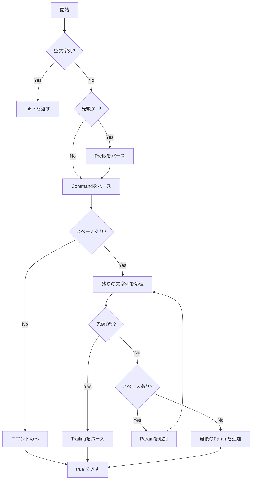

# メッセージパース詳細

このドキュメントでは、IRCメッセージのパースと生成を担当する`Message`クラスの詳細な実装を説明します。

## 目次

1. [Messageクラスの概要](#messageクラスの概要)
2. [IRCメッセージフォーマット](#ircメッセージフォーマット)
3. [パース処理の実装](#パース処理の実装)
4. [数値応答の生成](#数値応答の生成)
5. [エラーハンドリング](#エラーハンドリング)
6. [実装例とテストケース](#実装例とテストケース)

---

## Messageクラスの概要

`Message`クラスは、IRCプロトコルのメッセージをパースし、生成する責務を持ちます。

### 主な責務

- 🎯 IRCメッセージのパース（文字列 → 構造化データ）
- 🎯 メッセージの構築（構造化データ → 文字列）
- 🎯 数値応答の生成

### クラス定義

```cpp
class Message {
private:
    std::string              _prefix;   // プレフィックス（送信元）
    std::string              _command;  // コマンド
    std::vector<std::string> _params;   // パラメータ
    std::string              _trailing; // 末尾パラメータ

public:
    // コンストラクタ・デストラクタ
    Message();
    Message(const std::string& raw);
    ~Message();

    // Getters
    const std::string&              getPrefix() const;
    const std::string&              getCommand() const;
    const std::vector<std::string>& getParams() const;
    const std::string&              getTrailing() const;

    // パース
    bool parse(const std::string& raw);

    // ユーティリティ
    std::string toString() const;
};

// 数値応答コード
namespace RPL {
    const int WELCOME = 1;
    const int NOTOPIC = 331;
    const int TOPIC = 332;
    const int NAMREPLY = 353;
    const int ENDOFNAMES = 366;
}

namespace ERR {
    const int NOSUCHNICK = 401;
    const int NOSUCHCHANNEL = 403;
    const int CANNOTSENDTOCHAN = 404;
    const int NORECIPIENT = 411;
    const int NOTEXTTOSEND = 412;
    const int NONICKNAMEGIVEN = 431;
    const int ERRONEUSNICKNAME = 432;
    const int NICKNAMEINUSE = 433;
    const int USERNOTINCHANNEL = 441;
    const int NOTONCHANNEL = 442;
    const int USERONCHANNEL = 443;
    const int NOTREGISTERED = 451;
    const int NEEDMOREPARAMS = 461;
    const int ALREADYREGISTRED = 462;
    const int PASSWDMISMATCH = 464;
    const int CHANNELISFULL = 471;
    const int UNKNOWNMODE = 472;
    const int INVITEONLYCHAN = 473;
    const int BADCHANNELKEY = 475;
    const int CHANOPRIVSNEEDED = 482;
}

// ヘルパー関数
std::string createReply(int code, const std::string& client, const std::string& msg);
std::string createReply(int code, const std::string& client, 
                       const std::string& target, const std::string& msg);
```

---

## IRCメッセージフォーマット

### 基本フォーマット

```
[:<prefix>] <command> [<params>] [:<trailing>]\r\n
```

### 各要素の詳細

#### Prefix（プレフィックス）- オプション

- `:` で始まる
- メッセージの送信元を示す
- サーバーからクライアントへのメッセージに含まれる

**形式:**
```
:nickname!username@hostname
```

**例:**
```
:alice!alice@192.168.1.100
:localhost
```

#### Command（コマンド）- 必須

- 実行するアクション
- 文字列または3桁の数値コード

**例:**
```
PRIVMSG
JOIN
001
461
```

#### Params（パラメータ）- オプション

- スペースで区切られた引数
- 最大15個まで
- スペースを含まない

**例:**
```
#general
alice
+i
```

#### Trailing（末尾パラメータ）- オプション

- `:` で始まる
- スペースを含むことができる最後のパラメータ

**例:**
```
:Hello, everyone!
:Welcome to the IRC Network
```

---

## パース処理の実装

### parse() - メッセージのパース

```cpp
bool Message::parse(const std::string& raw) {
    if (raw.empty())
        return false;

    _prefix.clear();
    _command.clear();
    _params.clear();
    _trailing.clear();

    std::string line = raw;
    size_t pos = 0;

    // 1. Prefixのパース（オプション）
    if (line[0] == ':') {
        pos = line.find(' ');
        if (pos == std::string::npos)
            return false;
        _prefix = line.substr(1, pos - 1);  // 先頭の':'を除く
        line = line.substr(pos + 1);
    }

    // 2. Commandのパース（必須）
    pos = line.find(' ');
    if (pos == std::string::npos) {
        _command = line;
        return true;  // コマンドのみのメッセージ
    }
    _command = line.substr(0, pos);
    line = line.substr(pos + 1);

    // 3. ParamsとTrailingのパース
    while (!line.empty()) {
        if (line[0] == ':') {
            _trailing = line.substr(1);  // 先頭の':'を除く
            break;
        }
        pos = line.find(' ');
        if (pos == std::string::npos) {
            _params.push_back(line);
            break;
        }
        _params.push_back(line.substr(0, pos));
        line = line.substr(pos + 1);
    }

    return true;
}
```

### パース処理のフローチャート



---

### パース例

#### 例1: 単純なコマンド

**入力:**
```
PING
```

**パース結果:**
```cpp
_prefix = ""
_command = "PING"
_params = []
_trailing = ""
```

#### 例2: パラメータ付きコマンド

**入力:**
```
NICK alice
```

**パース結果:**
```cpp
_prefix = ""
_command = "NICK"
_params = ["alice"]
_trailing = ""
```

#### 例3: Trailing付きコマンド

**入力:**
```
PRIVMSG #general :Hello, everyone!
```

**パース結果:**
```cpp
_prefix = ""
_command = "PRIVMSG"
_params = ["#general"]
_trailing = "Hello, everyone!"
```

#### 例4: Prefix付きメッセージ

**入力:**
```
:alice!alice@192.168.1.100 JOIN #general
```

**パース結果:**
```cpp
_prefix = "alice!alice@192.168.1.100"
_command = "JOIN"
_params = ["#general"]
_trailing = ""
```

#### 例5: 複数パラメータ

**入力:**
```
USER alice 0 * :Alice Smith
```

**パース結果:**
```cpp
_prefix = ""
_command = "USER"
_params = ["alice", "0", "*"]
_trailing = "Alice Smith"
```

#### 例6: 数値応答

**入力:**
```
:localhost 001 alice :Welcome to the IRC Network
```

**パース結果:**
```cpp
_prefix = "localhost"
_command = "001"
_params = ["alice"]
_trailing = "Welcome to the IRC Network"
```

---

## 数値応答の生成

### createReply() - 2パラメータ版

```cpp
std::string createReply(int code, const std::string& client, const std::string& msg) {
    std::ostringstream oss;
    oss << ":localhost ";
    
    // 3桁の数値コードにフォーマット
    if (code < 10)
        oss << "00" << code;
    else if (code < 100)
        oss << "0" << code;
    else
        oss << code;
    
    oss << " " << client << " " << msg << "\r\n";
    return oss.str();
}
```

**使用例:**
```cpp
// RPL_WELCOME (001)
std::string welcome = createReply(RPL::WELCOME, "alice", 
    ":Welcome to the Internet Relay Network");
// → ":localhost 001 alice :Welcome to the Internet Relay Network\r\n"

// ERR_NEEDMOREPARAMS (461)
std::string error = createReply(ERR::NEEDMOREPARAMS, "alice", 
    "PRIVMSG :Not enough parameters");
// → ":localhost 461 alice PRIVMSG :Not enough parameters\r\n"
```

---

### createReply() - 3パラメータ版

```cpp
std::string createReply(int code, const std::string& client, 
                       const std::string& target, const std::string& msg) {
    std::ostringstream oss;
    oss << ":localhost ";
    
    if (code < 10)
        oss << "00" << code;
    else if (code < 100)
        oss << "0" << code;
    else
        oss << code;
    
    oss << " " << client << " " << target << " " << msg << "\r\n";
    return oss.str();
}
```

**使用例:**
```cpp
// RPL_TOPIC (332)
std::string topic = createReply(RPL::TOPIC, "alice", "#general", 
    ":Welcome to the general channel");
// → ":localhost 332 alice #general :Welcome to the general channel\r\n"

// ERR_NOSUCHCHANNEL (403)
std::string error = createReply(ERR::NOSUCHCHANNEL, "alice", "#test", 
    ":No such channel");
// → ":localhost 403 alice #test :No such channel\r\n"
```

---

## エラーハンドリング

### パースエラーのチェック

```cpp
void Server::processClientMessage(Client* client, const std::string& message) {
    Message msg(message);
    
    // パースに失敗した場合
    if (msg.getCommand().empty()) {
        // エラーログを出力（クライアントには送信しない）
        std::cerr << "Failed to parse message: " << message << std::endl;
        return;
    }
    
    // コマンドを実行
    _commandHandler->execute(client, msg);
}
```

---

### 空メッセージのチェック

```cpp
std::string Client::extractMessage() {
    size_t pos = _recvBuffer.find("\r\n");
    if (pos == std::string::npos)
        return "";

    std::string message = _recvBuffer.substr(0, pos);
    _recvBuffer.erase(0, pos + 2);
    
    // 空メッセージをスキップ
    if (message.empty())
        return "";
    
    return message;
}
```

---

## 実装例とテストケース

### テストケース1: 基本的なコマンド

```cpp
void testBasicCommand() {
    Message msg("PING");
    assert(msg.getCommand() == "PING");
    assert(msg.getParams().empty());
    assert(msg.getTrailing().empty());
}
```

---

### テストケース2: パラメータ付きコマンド

```cpp
void testCommandWithParams() {
    Message msg("JOIN #general");
    assert(msg.getCommand() == "JOIN");
    assert(msg.getParams().size() == 1);
    assert(msg.getParams()[0] == "#general");
    assert(msg.getTrailing().empty());
}
```

---

### テストケース3: Trailing付きコマンド

```cpp
void testCommandWithTrailing() {
    Message msg("PRIVMSG #general :Hello, world!");
    assert(msg.getCommand() == "PRIVMSG");
    assert(msg.getParams().size() == 1);
    assert(msg.getParams()[0] == "#general");
    assert(msg.getTrailing() == "Hello, world!");
}
```

---

### テストケース4: 複数パラメータ

```cpp
void testMultipleParams() {
    Message msg("USER alice 0 * :Alice Smith");
    assert(msg.getCommand() == "USER");
    assert(msg.getParams().size() == 3);
    assert(msg.getParams()[0] == "alice");
    assert(msg.getParams()[1] == "0");
    assert(msg.getParams()[2] == "*");
    assert(msg.getTrailing() == "Alice Smith");
}
```

---

### テストケース5: Prefix付きメッセージ

```cpp
void testMessageWithPrefix() {
    Message msg(":alice!alice@192.168.1.100 JOIN #general");
    assert(msg.getPrefix() == "alice!alice@192.168.1.100");
    assert(msg.getCommand() == "JOIN");
    assert(msg.getParams().size() == 1);
    assert(msg.getParams()[0] == "#general");
}
```

---

### テストケース6: 数値応答

```cpp
void testNumericReply() {
    Message msg(":localhost 001 alice :Welcome to IRC");
    assert(msg.getPrefix() == "localhost");
    assert(msg.getCommand() == "001");
    assert(msg.getParams().size() == 1);
    assert(msg.getParams()[0] == "alice");
    assert(msg.getTrailing() == "Welcome to IRC");
}
```

---

### テストケース7: 空のTrailing

```cpp
void testEmptyTrailing() {
    Message msg("PRIVMSG #general :");
    assert(msg.getCommand() == "PRIVMSG");
    assert(msg.getParams().size() == 1);
    assert(msg.getParams()[0] == "#general");
    assert(msg.getTrailing() == "");  // 空文字列
}
```

---

### テストケース8: Trailingのスペース

```cpp
void testTrailingWithSpaces() {
    Message msg("PRIVMSG #general :  Hello   World  ");
    assert(msg.getCommand() == "PRIVMSG");
    assert(msg.getParams().size() == 1);
    assert(msg.getParams()[0] == "#general");
    assert(msg.getTrailing() == "  Hello   World  ");  // スペースも保持
}
```

---

## toString() - メッセージの構築

```cpp
std::string Message::toString() const {
    std::ostringstream oss;

    if (!_prefix.empty())
        oss << ":" << _prefix << " ";

    oss << _command;

    for (size_t i = 0; i < _params.size(); ++i)
        oss << " " << _params[i];

    if (!_trailing.empty())
        oss << " :" << _trailing;

    oss << "\r\n";
    return oss.str();
}
```

**使用例:**
```cpp
Message msg;
msg._command = "PRIVMSG";
msg._params.push_back("#general");
msg._trailing = "Hello, world!";

std::string str = msg.toString();
// → "PRIVMSG #general :Hello, world!\r\n"
```

---

## 数値応答コード一覧

### 成功応答（RPL_*）

| コード | 名前 | 説明 | 使用例 |
|--------|------|------|--------|
| 001 | RPL_WELCOME | 接続成功 | `:localhost 001 alice :Welcome` |
| 331 | RPL_NOTOPIC | トピック未設定 | `:localhost 331 alice #general :No topic` |
| 332 | RPL_TOPIC | トピック表示 | `:localhost 332 alice #general :Topic` |
| 353 | RPL_NAMREPLY | メンバーリスト | `:localhost 353 alice = #general :@alice bob` |
| 366 | RPL_ENDOFNAMES | メンバーリスト終了 | `:localhost 366 alice #general :End` |

### エラー応答（ERR_*）

| コード | 名前 | 説明 | 使用例 |
|--------|------|------|--------|
| 401 | ERR_NOSUCHNICK | ユーザーが存在しない | `:localhost 401 alice bob :No such nick` |
| 403 | ERR_NOSUCHCHANNEL | チャンネルが存在しない | `:localhost 403 alice #test :No such channel` |
| 442 | ERR_NOTONCHANNEL | チャンネルに参加していない | `:localhost 442 alice #general :Not on channel` |
| 461 | ERR_NEEDMOREPARAMS | パラメータ不足 | `:localhost 461 alice PRIVMSG :Not enough parameters` |
| 464 | ERR_PASSWDMISMATCH | パスワード不一致 | `:localhost 464 alice :Password incorrect` |
| 471 | ERR_CHANNELISFULL | チャンネルが満員 | `:localhost 471 alice #general :Channel is full` |
| 473 | ERR_INVITEONLYCHAN | 招待制チャンネル | `:localhost 473 alice #general :Invite only` |
| 475 | ERR_BADCHANNELKEY | チャンネルキーが間違い | `:localhost 475 alice #general :Bad key` |
| 482 | ERR_CHANOPRIVSNEEDED | オペレーター権限が必要 | `:localhost 482 alice #general :Not operator` |

---

## まとめ

### Messageクラスの責務

✅ **パース**: IRCメッセージを構造化データに変換
✅ **構築**: 構造化データからIRCメッセージを生成
✅ **数値応答**: 成功・エラー応答の生成

### 重要なポイント

📌 **Prefix**: `:`で始まり、送信元を示す
📌 **Command**: 必須、文字列または数値コード
📌 **Params**: 最大15個、スペースを含まない
📌 **Trailing**: `:`で始まり、スペースを含むことができる
📌 **終端**: すべてのメッセージは`\r\n`で終了

### 次のステップ

- [07_COMMAND_HANDLING.md](07_COMMAND_HANDLING.md) - コマンドハンドラの詳細
- [08_COMMANDS_DETAIL.md](08_COMMANDS_DETAIL.md) - 各コマンドの実装詳細
- [09_DATA_FLOW.md](09_DATA_FLOW.md) - メッセージのデータフロー

---

**前のドキュメント**: [05_CHANNEL_CLASS.md](05_CHANNEL_CLASS.md)
**次のドキュメント**: [07_COMMAND_HANDLING.md](07_COMMAND_HANDLING.md)

