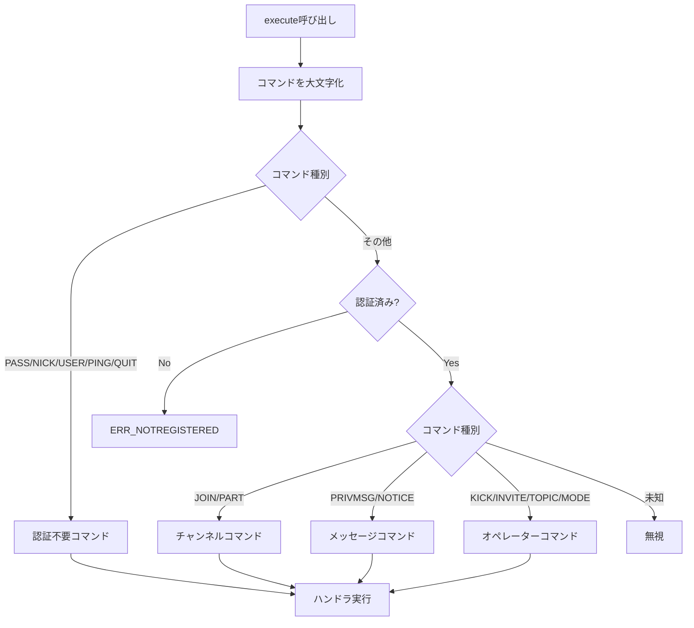

# コマンドハンドリング詳細

このドキュメントでは、IRC コマンドの処理を担当する`CommandHandler`クラスの詳細な実装を説明します。

## 目次

1. [CommandHandler クラスの概要](#commandhandlerクラスの概要)
2. [コマンドディスパッチ](#コマンドディスパッチ)
3. [認証前後の分岐](#認証前後の分岐)
4. [バリデーション処理](#バリデーション処理)
5. [各コマンドグループ](#各コマンドグループ)
6. [エラー応答の生成](#エラー応答の生成)

---

## CommandHandler クラスの概要

`CommandHandler`クラスは、IRC コマンドの実行とバリデーションを担当します。

### 主な責務

- 🎯 コマンドのディスパッチ（適切なハンドラに振り分け）
- 🎯 パラメータのバリデーション
- 🎯 権限チェック（認証、オペレーター）
- 🎯 エラー応答の生成

### クラス定義

```cpp
class CommandHandler {
private:
    Server* _server;  // サーバーへの参照

public:
    // コンストラクタ・デストラクタ
    CommandHandler(Server* server);
    ~CommandHandler();

    // コマンド実行
    void execute(Client* client, const Message& msg);

    // 認証コマンド
    void handlePass(Client* client, const Message& msg);
    void handleNick(Client* client, const Message& msg);
    void handleUser(Client* client, const Message& msg);

    // チャンネルコマンド
    void handleJoin(Client* client, const Message& msg);
    void handlePart(Client* client, const Message& msg);

    // メッセージコマンド
    void handlePrivmsg(Client* client, const Message& msg);
    void handleNotice(Client* client, const Message& msg);

    // オペレーターコマンド
    void handleKick(Client* client, const Message& msg);
    void handleInvite(Client* client, const Message& msg);
    void handleTopic(Client* client, const Message& msg);
    void handleMode(Client* client, const Message& msg);

    // ユーティリティコマンド
    void handlePing(Client* client, const Message& msg);
    void handleQuit(Client* client, const Message& msg);

private:
    // ヘルパー関数
    bool isValidNickname(const std::string& nickname) const;
    bool isValidChannelName(const std::string& name) const;
};
```

---

## コマンドディスパッチ

### execute() - コマンドの振り分け

```cpp
void CommandHandler::execute(Client* client, const Message& msg) {
    std::string command = msg.getCommand();

    // コマンドを大文字に変換
    std::transform(command.begin(), command.end(), command.begin(), ::toupper);

    // 認証前でも使用可能なコマンド
    if (command == "PASS") {
        handlePass(client, msg);
    } else if (command == "NICK") {
        handleNick(client, msg);
    } else if (command == "USER") {
        handleUser(client, msg);
    } else if (command == "PING") {
        handlePing(client, msg);
    } else if (command == "QUIT") {
        handleQuit(client, msg);
    }
    // 認証が必要なコマンド
    else if (!client->isAuthenticated()) {
        _server->sendToClient(client,
            createReply(ERR::NOTREGISTERED, "*", ":You have not registered"));
    }
    // チャンネルコマンド
    else if (command == "JOIN") {
        handleJoin(client, msg);
    } else if (command == "PART") {
        handlePart(client, msg);
    }
    // メッセージコマンド
    else if (command == "PRIVMSG") {
        handlePrivmsg(client, msg);
    } else if (command == "NOTICE") {
        handleNotice(client, msg);
    }
    // オペレーターコマンド
    else if (command == "KICK") {
        handleKick(client, msg);
    } else if (command == "INVITE") {
        handleInvite(client, msg);
    } else if (command == "TOPIC") {
        handleTopic(client, msg);
    } else if (command == "MODE") {
        handleMode(client, msg);
    }
    // 未知のコマンド（無視）
}
```

### コマンドディスパッチのフローチャート



---

## 認証前後の分岐

### 認証不要コマンド

以下のコマンドは認証前でも実行可能です：

- `PASS` - パスワード認証
- `NICK` - ニックネーム設定
- `USER` - ユーザー情報設定
- `PING` - サーバー応答確認
- `QUIT` - 切断

### 認証必要コマンド

それ以外のすべてのコマンドは認証後のみ実行可能です。

```cpp
if (!client->isAuthenticated()) {
    _server->sendToClient(client,
        createReply(ERR::NOTREGISTERED, "*", ":You have not registered"));
    return;
}
```

---

## バリデーション処理

### ニックネームのバリデーション

```cpp
bool CommandHandler::isValidNickname(const std::string& nickname) const {
    // 長さチェック（1-9文字）
    if (nickname.empty() || nickname.length() > 9)
        return false;

    // 最初の文字は英字または'_'
    if (!std::isalpha(nickname[0]) && nickname[0] != '_')
        return false;

    // 2文字目以降は英数字、'_'、'-'
    for (size_t i = 1; i < nickname.length(); ++i) {
        if (!std::isalnum(nickname[i]) &&
            nickname[i] != '_' && nickname[i] != '-')
            return false;
    }

    return true;
}
```

**有効なニックネーム:**

- `alice`
- `bob123`
- `_test`
- `user-1`

**無効なニックネーム:**

- `123abc` （数字で始まる）
- `alice@home` （@を含む）
- `verylongname` （9 文字超）

---

### チャンネル名のバリデーション

```cpp
bool CommandHandler::isValidChannelName(const std::string& name) const {
    // 空文字列チェック
    if (name.empty())
        return false;

    // 最初の文字は'#'または'&'
    if (name[0] != '#' && name[0] != '&')
        return false;

    // 長さチェック（最大50文字）
    if (name.length() > 50)
        return false;

    // 禁止文字チェック（スペース、カンマ、コロン）
    for (size_t i = 1; i < name.length(); ++i) {
        if (name[i] == ' ' || name[i] == ',' || name[i] == ':')
            return false;
    }

    return true;
}
```

**有効なチャンネル名:**

- `#general`
- `#test-channel`
- `&local`

**無効なチャンネル名:**

- `general` （#で始まらない）
- `#test channel` （スペースを含む）
- `#a,b` （カンマを含む）

---

## 各コマンドグループ

### 認証コマンド

#### PASS - パスワード認証

```cpp
void CommandHandler::handlePass(Client* client, const Message& msg) {
    // 既に認証済みチェック
    if (client->isAuthenticated()) {
        _server->sendToClient(client,
            createReply(ERR::ALREADYREGISTRED, client->getNickname(),
                       ":You may not reregister"));
        return;
    }

    // パラメータチェック
    const std::vector<std::string>& params = msg.getParams();
    std::string password = params.empty() ? msg.getTrailing() : params[0];

    if (password.empty()) {
        _server->sendToClient(client,
            createReply(ERR::NEEDMOREPARAMS, "*", "PASS :Not enough parameters"));
        return;
    }

    // パスワード検証
    if (password == _server->getPassword()) {
        client->setPassword(true);
    } else {
        _server->sendToClient(client,
            createReply(ERR::PASSWDMISMATCH, "*", ":Password incorrect"));
        return;
    }

    // 認証完了チェック
    if (client->hasPassword() && client->hasNick() && client->hasUser()) {
        client->setAuthenticated(true);
        std::string welcome = createReply(RPL::WELCOME, client->getNickname(),
            ":Welcome to the Internet Relay Network " + client->getPrefix());
        _server->sendToClient(client, welcome);
    }
}
```

---

#### NICK - ニックネーム設定

```cpp
void CommandHandler::handleNick(Client* client, const Message& msg) {
    // パラメータチェック
    const std::vector<std::string>& params = msg.getParams();
    if (params.empty()) {
        _server->sendToClient(client,
            createReply(ERR::NONICKNAMEGIVEN, "*", ":No nickname given"));
        return;
    }

    std::string newNick = params[0];

    // ニックネームのバリデーション
    if (!isValidNickname(newNick)) {
        _server->sendToClient(client,
            createReply(ERR::ERRONEUSNICKNAME, "*",
                       newNick + " :Erroneous nickname"));
        return;
    }

    // 重複チェック
    Client* existing = _server->getClientByNickname(newNick);
    if (existing && existing != client) {
        _server->sendToClient(client,
            createReply(ERR::NICKNAMEINUSE, "*",
                       newNick + " :Nickname is already in use"));
        return;
    }

    // ニックネーム変更通知（既に認証済みの場合）
    if (client->isAuthenticated()) {
        std::string nickMsg = ":" + client->getPrefix() +
                             " NICK " + newNick + "\r\n";
        // 自分が参加しているチャンネルにブロードキャスト
        _server->broadcastToClientChannels(client, nickMsg, NULL);
    }

    // ニックネームを設定
    client->setNickname(newNick);

    // 認証完了チェック
    if (client->hasPassword() && client->hasNick() && client->hasUser() &&
        !client->isAuthenticated()) {
        client->setAuthenticated(true);
        std::string welcome = createReply(RPL::WELCOME, client->getNickname(),
            ":Welcome to the Internet Relay Network " + client->getPrefix());
        _server->sendToClient(client, welcome);
    }
}
```

---

### ユーティリティコマンド

#### PING - サーバー応答確認

```cpp
void CommandHandler::handlePing(Client* client, const Message& msg) {
    std::string response = ":localhost PONG localhost";

    if (!msg.getParams().empty())
        response += " :" + msg.getParams()[0];
    else if (!msg.getTrailing().empty())
        response += " :" + msg.getTrailing();

    response += "\r\n";
    _server->sendToClient(client, response);
}
```

**使用例:**

```
クライアント: PING
サーバー: :localhost PONG localhost

クライアント: PING :test
サーバー: :localhost PONG localhost :test
```

---

#### QUIT - 切断

```cpp
void CommandHandler::handleQuit(Client* client, const Message& msg) {
    std::string reason = msg.getTrailing().empty() ? "Client quit" : msg.getTrailing();
    _server->disconnectClient(client, reason);
}
```

---

## エラー応答の生成

### パラメータ不足

```cpp
if (params.size() < 2) {
    _server->sendToClient(client,
        createReply(ERR::NEEDMOREPARAMS, client->getNickname(),
                   "KICK :Not enough parameters"));
    return;
}
```

---

### チャンネルが存在しない

```cpp
Channel* channel = _server->getChannel(channelName);
if (!channel) {
    _server->sendToClient(client,
        createReply(ERR::NOSUCHCHANNEL, client->getNickname(),
                   channelName + " :No such channel"));
    return;
}
```

---

### チャンネルに参加していない

```cpp
if (!channel->isMember(client)) {
    _server->sendToClient(client,
        createReply(ERR::NOTONCHANNEL, client->getNickname(),
                   channelName + " :You're not on that channel"));
    return;
}
```

---

### オペレーター権限が必要

```cpp
if (!channel->isOperator(client)) {
    _server->sendToClient(client,
        createReply(ERR::CHANOPRIVSNEEDED, client->getNickname(),
                   channelName + " :You're not channel operator"));
    return;
}
```

---

## まとめ

### CommandHandler の責務

✅ **コマンドディスパッチ**: 適切なハンドラに振り分け
✅ **バリデーション**: パラメータと権限のチェック
✅ **エラー応答**: 適切なエラーメッセージの生成
✅ **認証管理**: 認証前後のコマンド分岐

### 重要なポイント

📌 **認証不要コマンド**: PASS, NICK, USER, PING, QUIT
📌 **認証必要コマンド**: それ以外のすべて
📌 **バリデーション**: ニックネーム、チャンネル名の形式チェック
📌 **権限チェック**: オペレーターコマンドでは権限を確認

### 次のステップ

- [08_COMMANDS_DETAIL.md](08_COMMANDS_DETAIL.md) - 各コマンドの実装詳細
- [09_DATA_FLOW.md](09_DATA_FLOW.md) - コマンド処理のデータフロー

---

**前のドキュメント**: [06_MESSAGE_PARSING.md](06_MESSAGE_PARSING.md)
**次のドキュメント**: [08_COMMANDS_DETAIL.md](08_COMMANDS_DETAIL.md)
