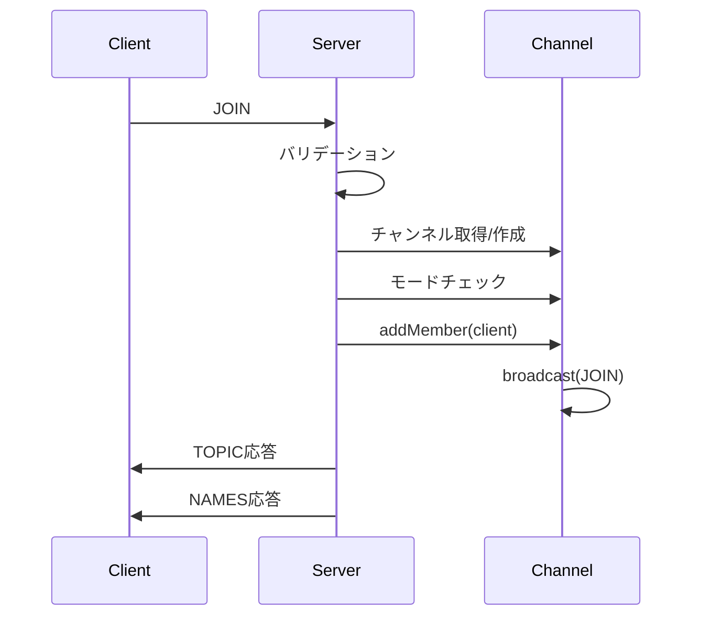

# IRC コマンド実装詳細

このドキュメントでは、ft_irc で実装されているすべての IRC コマンドの詳細な実装を説明します。

## 目次

1. [認証コマンド](#認証コマンド)
2. [チャンネルコマンド](#チャンネルコマンド)
3. [メッセージコマンド](#メッセージコマンド)
4. [オペレーターコマンド](#オペレーターコマンド)
5. [ユーティリティコマンド](#ユーティリティコマンド)

---

## 認証コマンド

### PASS - パスワード認証

**構文**: `PASS <password>`

**説明**: サーバーに接続するためのパスワードを送信します。

**実装のポイント**:

- 認証完了前のみ実行可能
- NICK/USER の前に実行する必要がある
- パスワードが一致しない場合は ERR_PASSWDMISMATCH

**エラーケース**:

- `ERR_NEEDMOREPARAMS (461)`: パラメータ不足
- `ERR_ALREADYREGISTRED (462)`: すでに認証済み
- `ERR_PASSWDMISMATCH (464)`: パスワード不一致

---

### NICK - ニックネーム設定

**構文**: `NICK <nickname>`

**説明**: ユーザーのニックネームを設定または変更します。

**実装のポイント**:

- 1-9 文字、英字または`_`で始まる
- 2 文字目以降は英数字、`_`、`-`
- サーバー内で一意である必要がある
- 認証後の変更は全チャンネルにブロードキャスト

**エラーケース**:

- `ERR_NONICKNAMEGIVEN (431)`: ニックネーム未指定
- `ERR_ERRONEUSNICKNAME (432)`: 無効なニックネーム
- `ERR_NICKNAMEINUSE (433)`: ニックネームが使用中

---

### USER - ユーザー情報設定

**構文**: `USER <username> <hostname> <servername> <realname>`

**説明**: ユーザーの詳細情報を設定します。

**実装のポイント**:

- 認証完了前のみ実行可能
- realname は`:`で始まる trailing パラメータ
- PASS, NICK と合わせて認証完了

**エラーケース**:

- `ERR_NEEDMOREPARAMS (461)`: パラメータ不足
- `ERR_ALREADYREGISTRED (462)`: すでに認証済み

---

## チャンネルコマンド

### JOIN - チャンネル参加

**構文**: `JOIN <channel> [key]`

**説明**: 指定されたチャンネルに参加します。

**実装のポイント**:

- チャンネルが存在しない場合は自動作成
- 最初のユーザーは自動的にオペレーターになる
- モードチェック: 招待制、ユーザー数制限、キー
- 参加成功時は JOIN、TOPIC、NAMES を送信

**シーケンス図**:



**エラーケース**:

- `ERR_NEEDMOREPARAMS (461)`: パラメータ不足
- `ERR_NOSUCHCHANNEL (403)`: 無効なチャンネル名
- `ERR_INVITEONLYCHAN (473)`: 招待制チャンネル
- `ERR_CHANNELISFULL (471)`: チャンネルが満員
- `ERR_BADCHANNELKEY (475)`: キーが間違っている

---

### PART - チャンネル退出

**構文**: `PART <channel> [reason]`

**説明**: 指定されたチャンネルから退出します。

**実装のポイント**:

- PART 通知をすべてのメンバーに送信
- メンバーから削除
- 空チャンネルは削除

**エラーケース**:

- `ERR_NEEDMOREPARAMS (461)`: パラメータ不足
- `ERR_NOSUCHCHANNEL (403)`: チャンネルが存在しない
- `ERR_NOTONCHANNEL (442)`: チャンネルに参加していない

---

## メッセージコマンド

### PRIVMSG - プライベートメッセージ

**構文**: `PRIVMSG <target> <message>`

**説明**: ユーザーまたはチャンネルにメッセージを送信します。

**実装のポイント**:

- target が`#`または`&`で始まる場合はチャンネル
- それ以外はユーザー
- チャンネルの場合は送信者以外にブロードキャスト
- ユーザーの場合は直接送信

**エラーケース**:

- `ERR_NORECIPIENT (411)`: 受信者未指定
- `ERR_NOTEXTTOSEND (412)`: テキスト未指定
- `ERR_NOSUCHNICK (401)`: ユーザーが存在しない
- `ERR_NOSUCHCHANNEL (403)`: チャンネルが存在しない
- `ERR_CANNOTSENDTOCHAN (404)`: チャンネルに送信できない

---

### NOTICE - 通知

**構文**: `NOTICE <target> <message>`

**説明**: PRIVMSG と同様だが、エラー応答を返さない。

**実装のポイント**:

- PRIVMSG と同じ処理
- エラー時は無視（応答を返さない）
- 自動応答ループを防ぐために使用

---

## オペレーターコマンド

### KICK - ユーザー追放

**構文**: `KICK <channel> <user> [reason]`

**説明**: チャンネルからユーザーを追放します。

**実装のポイント**:

- オペレーター権限が必要
- KICK 通知をすべてのメンバーに送信
- ユーザーをチャンネルから削除
- 空チャンネルは削除

**エラーケース**:

- `ERR_NEEDMOREPARAMS (461)`: パラメータ不足
- `ERR_NOSUCHCHANNEL (403)`: チャンネルが存在しない
- `ERR_NOTONCHANNEL (442)`: チャンネルに参加していない
- `ERR_CHANOPRIVSNEEDED (482)`: オペレーター権限が必要
- `ERR_USERNOTINCHANNEL (441)`: ユーザーがチャンネルにいない

---

### INVITE - ユーザー招待

**構文**: `INVITE <nickname> <channel>`

**説明**: ユーザーをチャンネルに招待します。

**実装のポイント**:

- オペレーター権限が必要
- 招待リストに追加
- 招待通知を対象ユーザーに送信

**エラーケース**:

- `ERR_NEEDMOREPARAMS (461)`: パラメータ不足
- `ERR_NOSUCHCHANNEL (403)`: チャンネルが存在しない
- `ERR_NOTONCHANNEL (442)`: チャンネルに参加していない
- `ERR_CHANOPRIVSNEEDED (482)`: オペレーター権限が必要
- `ERR_NOSUCHNICK (401)`: ユーザーが存在しない
- `ERR_USERONCHANNEL (443)`: ユーザーが既に参加している

---

### TOPIC - トピック管理

**構文**: `TOPIC <channel> [topic]`

**説明**: チャンネルのトピックを表示または変更します。

**実装のポイント**:

- トピックなし: 現在のトピックを表示
- トピックあり: トピックを変更
- トピック制限モード(+t)の場合、オペレーターのみ変更可能

**エラーケース**:

- `ERR_NEEDMOREPARAMS (461)`: パラメータ不足
- `ERR_NOSUCHCHANNEL (403)`: チャンネルが存在しない
- `ERR_NOTONCHANNEL (442)`: チャンネルに参加していない
- `ERR_CHANOPRIVSNEEDED (482)`: オペレーター権限が必要

---

### MODE - チャンネルモード変更

**構文**: `MODE <channel> <flags> [params]`

**説明**: チャンネルのモードを変更します。

**サポートされるモード**:

- `+i` / `-i`: 招待制モード
- `+t` / `-t`: トピック制限モード
- `+k <key>` / `-k`: チャンネルキー
- `+o <nick>` / `-o <nick>`: オペレーター権限
- `+l <limit>` / `-l`: ユーザー数制限

**実装のポイント**:

- オペレーター権限が必要
- 複数のモードを同時に変更可能
- MODE 変更をすべてのメンバーにブロードキャスト

**エラーケース**:

- `ERR_NEEDMOREPARAMS (461)`: パラメータ不足
- `ERR_NOSUCHCHANNEL (403)`: チャンネルが存在しない
- `ERR_NOTONCHANNEL (442)`: チャンネルに参加していない
- `ERR_CHANOPRIVSNEEDED (482)`: オペレーター権限が必要
- `ERR_UNKNOWNMODE (472)`: 未知のモード

---

## ユーティリティコマンド

### PING - サーバー応答確認

**構文**: `PING [token]`

**説明**: サーバーが応答しているか確認します。

**実装のポイント**:

- PONG で応答
- token があれば含めて返す

---

### QUIT - 切断

**構文**: `QUIT [reason]`

**説明**: サーバーから切断します。

**実装のポイント**:

- QUIT 通知を全チャンネルにブロードキャスト
- すべてのチャンネルから削除
- クライアントを削除
- 接続を閉じる

---

## コマンド実装パターン

### 基本パターン

```cpp
void CommandHandler::handleCommand(Client* client, const Message& msg) {
    // 1. パラメータチェック
    const std::vector<std::string>& params = msg.getParams();
    if (params.size() < required_params) {
        _server->sendToClient(client,
            createReply(ERR::NEEDMOREPARAMS, client->getNickname(),
                       "COMMAND :Not enough parameters"));
        return;
    }

    // 2. リソース取得
    Channel* channel = _server->getChannel(channelName);
    if (!channel) {
        _server->sendToClient(client,
            createReply(ERR::NOSUCHCHANNEL, client->getNickname(),
                       channelName + " :No such channel"));
        return;
    }

    // 3. 権限チェック
    if (!channel->isMember(client)) {
        _server->sendToClient(client,
            createReply(ERR::NOTONCHANNEL, client->getNickname(),
                       channelName + " :You're not on that channel"));
        return;
    }

    if (!channel->isOperator(client)) {
        _server->sendToClient(client,
            createReply(ERR::CHANOPRIVSNEEDED, client->getNickname(),
                       channelName + " :You're not channel operator"));
        return;
    }

    // 4. コマンド実行
    // ...

    // 5. 通知のブロードキャスト
    std::string notification = ":" + client->getPrefix() +
                              " COMMAND " + params + "\r\n";
    channel->broadcast(notification, NULL);
}
```

---

## まとめ

### コマンドカテゴリ

✅ **認証コマンド**: PASS, NICK, USER
✅ **チャンネルコマンド**: JOIN, PART
✅ **メッセージコマンド**: PRIVMSG, NOTICE
✅ **オペレーターコマンド**: KICK, INVITE, TOPIC, MODE
✅ **ユーティリティコマンド**: PING, QUIT

### 実装の共通パターン

📌 **パラメータチェック**: 必須パラメータの確認
📌 **リソース取得**: チャンネル/ユーザーの取得
📌 **権限チェック**: メンバー/オペレーター権限の確認
📌 **コマンド実行**: 実際の処理
📌 **通知**: 変更をブロードキャスト

### 次のステップ

- [09_DATA_FLOW.md](09_DATA_FLOW.md) - コマンド処理のデータフロー
- [11_TESTING.md](11_TESTING.md) - コマンドのテスト方法

---

**前のドキュメント**: [07_COMMAND_HANDLING.md](07_COMMAND_HANDLING.md)
**次のドキュメント**: [09_DATA_FLOW.md](09_DATA_FLOW.md)
