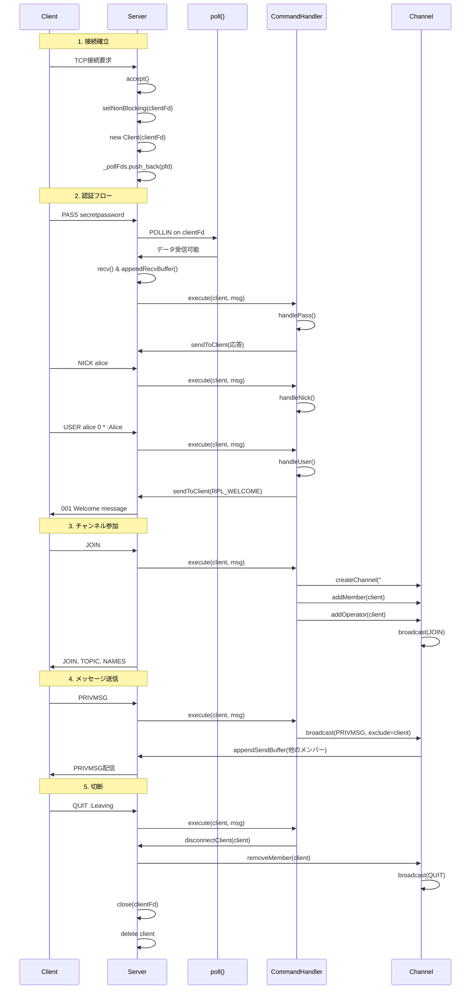
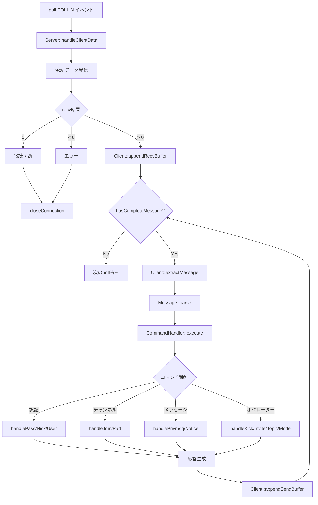
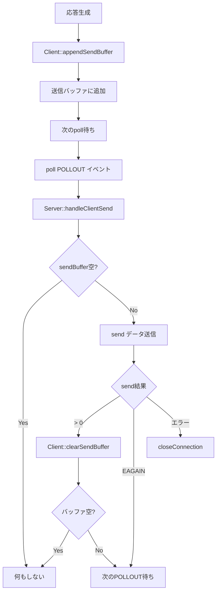
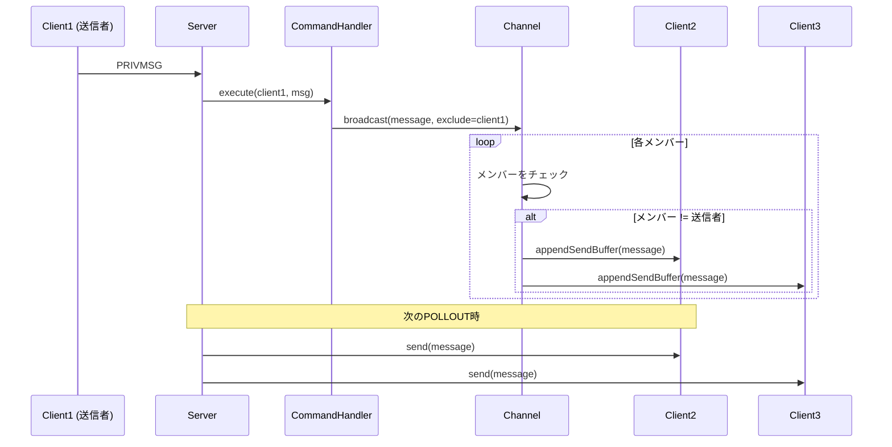

# データフロー詳細

このドキュメントでは、ft_ircシステム全体のデータフローを詳細に説明します。

## 目次

1. [クライアント接続から切断までの完全なフロー](#クライアント接続から切断までの完全なフロー)
2. [メッセージ受信から処理までの流れ](#メッセージ受信から処理までの流れ)
3. [送信バッファからクライアントへの送信](#送信バッファからクライアントへの送信)
4. [チャンネル内のメッセージブロードキャスト](#チャンネル内のメッセージブロードキャスト)
5. [実際の通信例](#実際の通信例)

---

## クライアント接続から切断までの完全なフロー



---

## メッセージ受信から処理までの流れ

### 詳細フローチャート



### ステップ詳細

#### 1. poll()イベント検出

```cpp
// Server::start()
int pollCount = poll(&_pollFds[0], _pollFds.size(), -1);

for (size_t i = 0; i < _pollFds.size(); ++i) {
    if (_pollFds[i].revents & POLLIN)
        handleClientData(_pollFds[i].fd);
}
```

#### 2. データ受信

```cpp
// Server::handleClientData()
char buffer[512];
ssize_t bytes = recv(fd, buffer, sizeof(buffer) - 1, 0);
client->appendRecvBuffer(std::string(buffer, bytes));
```

#### 3. 完全なメッセージのチェック

```cpp
// Client::hasCompleteMessage()
return _recvBuffer.find("\r\n") != std::string::npos;
```

#### 4. メッセージの抽出

```cpp
// Client::extractMessage()
size_t pos = _recvBuffer.find("\r\n");
std::string message = _recvBuffer.substr(0, pos);
_recvBuffer.erase(0, pos + 2);
return message;
```

#### 5. メッセージのパース

```cpp
// Message::parse()
// Prefix, Command, Params, Trailingを抽出
```

#### 6. コマンドの実行

```cpp
// CommandHandler::execute()
// コマンドに応じた処理を実行
```

---

## 送信バッファからクライアントへの送信

### 送信フロー



### 実装詳細

#### 1. 送信バッファへの追加

```cpp
void Server::sendToClient(Client* client, const std::string& message) {
    if (client)
        client->appendSendBuffer(message);
}

void Client::appendSendBuffer(const std::string& data) {
    _sendBuffer += data;
}
```

#### 2. 送信処理

```cpp
void Server::handleClientSend(int fd) {
    Client* client = getClient(fd);
    if (!client || client->getSendBuffer().empty())
        return;

    const std::string& buffer = client->getSendBuffer();
    ssize_t bytes = send(fd, buffer.c_str(), buffer.size(), 0);

    if (bytes > 0) {
        client->clearSendBuffer(bytes);
    } else if (bytes < 0) {
        if (errno != EAGAIN && errno != EWOULDBLOCK) {
            closeConnection(fd, "Send error");
        }
    }
}
```

---

## チャンネル内のメッセージブロードキャスト

### ブロードキャストフロー



### 実装詳細

```cpp
void Channel::broadcast(const std::string& message, Client* exclude) {
    for (std::vector<Client*>::iterator it = _members.begin(); 
         it != _members.end(); ++it) {
        if (*it != exclude)
            (*it)->appendSendBuffer(message);
    }
}
```

---

## 実際の通信例

### 例1: 認証フロー

```
クライアント → サーバー: PASS secretpassword\r\n
サーバー → クライアント: (応答なし、内部で認証状態更新)

クライアント → サーバー: NICK alice\r\n
サーバー → クライアント: (応答なし、内部で認証状態更新)

クライアント → サーバー: USER alice 0 * :Alice Smith\r\n
サーバー → クライアント: :localhost 001 alice :Welcome to the Internet Relay Network alice!alice@192.168.1.100\r\n
```

### 例2: チャンネル参加

```
クライアント → サーバー: JOIN #general\r\n

サーバー → クライアント: :alice!alice@192.168.1.100 JOIN #general\r\n
サーバー → クライアント: :localhost 331 alice #general :No topic is set\r\n
サーバー → クライアント: :localhost 353 alice = #general :@alice\r\n
サーバー → クライアント: :localhost 366 alice #general :End of NAMES list\r\n
```

### 例3: メッセージ送信

```
Alice → サーバー: PRIVMSG #general :Hello, everyone!\r\n

サーバー → Bob: :alice!alice@192.168.1.100 PRIVMSG #general :Hello, everyone!\r\n
サーバー → Charlie: :alice!alice@192.168.1.100 PRIVMSG #general :Hello, everyone!\r\n
(Aliceには送信されない)
```

### 例4: オペレーターコマンド

```
Alice → サーバー: KICK #general bob :Spamming\r\n

サーバー → Alice: :alice!alice@192.168.1.100 KICK #general bob :Spamming\r\n
サーバー → Bob: :alice!alice@192.168.1.100 KICK #general bob :Spamming\r\n
サーバー → Charlie: :alice!alice@192.168.1.100 KICK #general bob :Spamming\r\n
(すべてのメンバーに送信)
```

---

## データフローのタイミング図

### 部分受信の例

```
時刻 t0: recv() → "PRIVMSG #ge"
         _recvBuffer = "PRIVMSG #ge"
         hasCompleteMessage() = false
         → 処理せずに待機

時刻 t1: recv() → "neral :Hello\r\n"
         _recvBuffer = "PRIVMSG #general :Hello\r\n"
         hasCompleteMessage() = true
         extractMessage() → "PRIVMSG #general :Hello"
         _recvBuffer = ""
         → コマンド処理実行
```

### 部分送信の例

```
時刻 t0: appendSendBuffer(":server 001 alice :Welcome...\r\n")  // 50バイト
         _sendBuffer = ":server 001 alice :Welcome...\r\n"

時刻 t1: POLLOUT イベント
         send() → 30バイト送信成功
         clearSendBuffer(30)
         _sendBuffer = "ome...\r\n"  // 残り20バイト

時刻 t2: POLLOUT イベント
         send() → 20バイト送信成功
         clearSendBuffer(20)
         _sendBuffer = ""  // 完了
```

---

## まとめ

### データフローの特徴

✅ **非ブロッキング**: すべてのI/O操作は非ブロッキング
✅ **イベント駆動**: poll()でイベントを検出して処理
✅ **バッファリング**: 部分送受信に対応
✅ **ブロードキャスト**: チャンネル内のメッセージ配信

### 重要なポイント

📌 **poll()は1つ**: すべてのfdを1つのpoll()で監視
📌 **部分送受信**: バッファを使用して対応
📌 **送信者除外**: ブロードキャスト時は送信者を除外
📌 **即座に送信しない**: 送信バッファに追加し、POLLOUTで送信

### 次のステップ

- [10_ERROR_HANDLING.md](10_ERROR_HANDLING.md) - エラーハンドリング
- [11_TESTING.md](11_TESTING.md) - テスト方法

---

**前のドキュメント**: [08_COMMANDS_DETAIL.md](08_COMMANDS_DETAIL.md)
**次のドキュメント**: [10_ERROR_HANDLING.md](10_ERROR_HANDLING.md)

